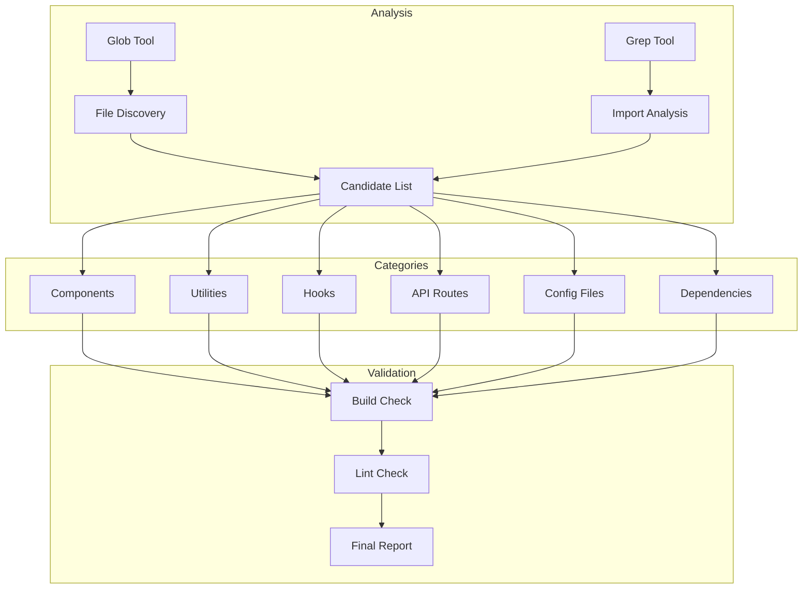
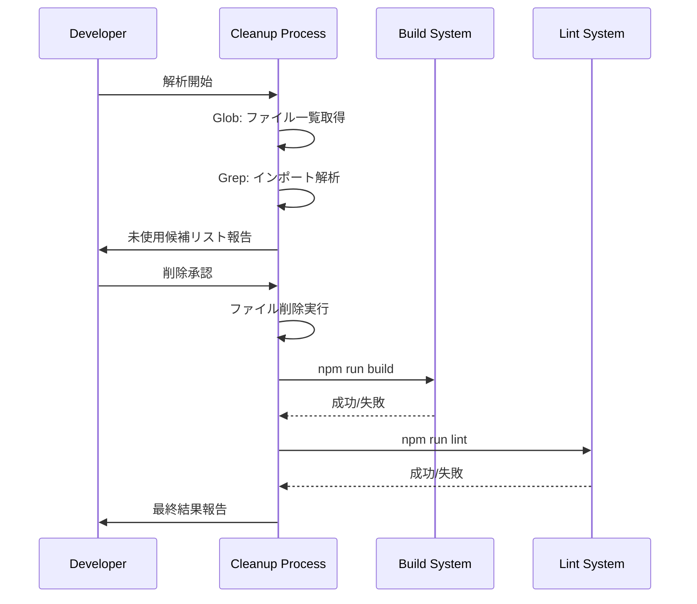
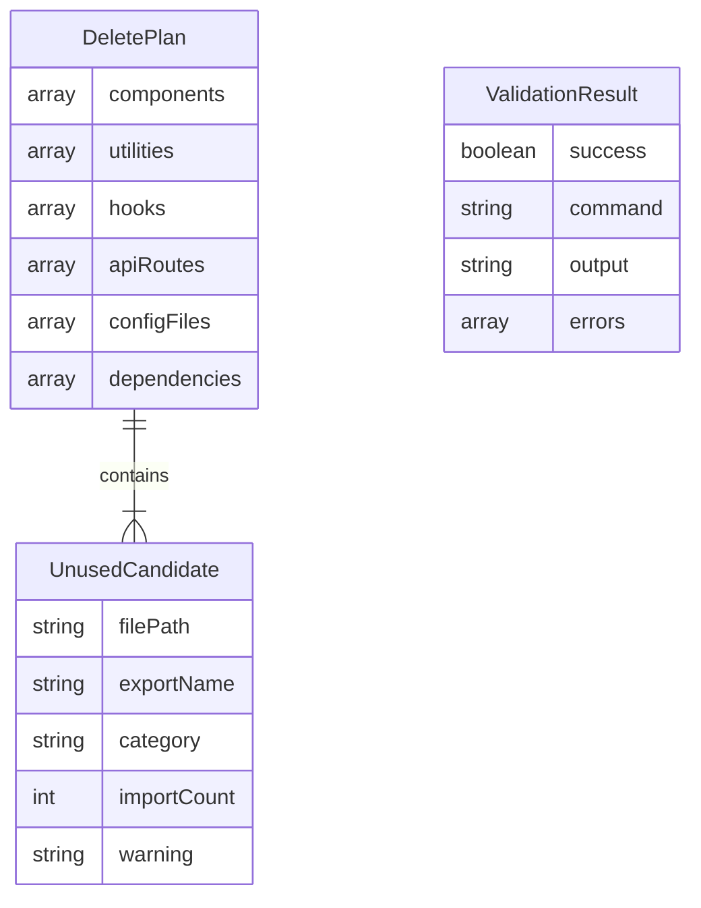

# Design Document: Codebase Cleanup

## Overview

**Purpose**: 本機能は、Video AITuberプロジェクト内の未使用コード・コンポーネント・依存関係を特定・削除し、コードベースの保守性と可読性を向上させる。

**Users**: 開発者がリポジトリ整理・リファクタリング作業に利用する。

**Impact**: `/components/`、`/lib/`、`/hooks/`、`/app/api/`、`/config/`ディレクトリおよび`package.json`内の未使用要素を削除する。

### Goals
- 未使用コンポーネント・ユーティリティ・フック・APIルートの特定と削除
- 未使用npm依存関係の特定と削除
- 未使用設定ファイルの特定と削除
- 削除後のビルド・リント成功を保証

### Non-Goals
- テストカバレッジの向上
- パフォーマンス最適化
- 新機能の追加
- コードリファクタリング（未使用コード削除以外）

## Architecture

### Existing Architecture Analysis

現在のプロジェクト構造:
- **コンポーネント**: 10ファイル（`/components/`）
- **ユーティリティ**: 11ファイル（`/lib/`）
- **フック**: 7ファイル（`/hooks/`）
- **APIルート**: 15ファイル（`/app/api/`）
- **設定ファイル**: 3ファイル（`/config/`）
- **依存関係**: 4個（dependencies）、12個（devDependencies）

### Architecture Pattern & Boundary Map



**Architecture Integration**:
- 選択パターン: 手動静的解析（Glob/Grepベース）
- 境界: 各カテゴリを独立して解析・削除
- 既存パターン維持: Next.js App Router構造を尊重
- 新コンポーネント: なし（既存ツールのみ使用）
- ステアリング準拠: TypeScript strict mode、ESLint設定を活用

### Technology Stack

| Layer | Choice / Version | Role in Feature | Notes |
|-------|------------------|-----------------|-------|
| Analysis | Glob/Grep Tools | ファイル検索・インポート解析 | Claude Code内蔵ツール |
| Validation | npm run build | ビルド検証 | Next.js 16 |
| Validation | npm run lint | リント検証 | ESLint 9 |

## System Flows

### 解析・削除フロー



## Requirements Traceability

| Requirement | Summary | Components | Interfaces | Flows |
|-------------|---------|------------|------------|-------|
| 1.1, 1.2, 1.3 | コンポーネント検出 | ComponentAnalyzer | GlobPattern, GrepPattern | Analysis Flow |
| 2.1, 2.2, 2.3 | ユーティリティ検出 | UtilityAnalyzer | GlobPattern, GrepPattern | Analysis Flow |
| 3.1, 3.2, 3.3 | APIルート検出 | ApiRouteAnalyzer | GlobPattern, GrepPattern | Analysis Flow |
| 4.1, 4.2, 4.3 | 依存関係検出 | DependencyAnalyzer | PackageJsonReader | Analysis Flow |
| 5.1, 5.2 | 設定ファイル検出 | ConfigAnalyzer | GlobPattern, GrepPattern | Analysis Flow |
| 6.1, 6.2, 6.3, 6.4 | 安全な削除 | DeleteExecutor | BuildValidator | Validation Flow |
| 7.1, 7.2, 7.3 | 削除検証 | ValidationRunner | BuildResult, LintResult | Validation Flow |

## Components and Interfaces

| Component | Domain/Layer | Intent | Req Coverage | Key Dependencies | Contracts |
|-----------|--------------|--------|--------------|------------------|-----------|
| ComponentAnalyzer | Analysis | コンポーネント使用状況解析 | 1.1, 1.2, 1.3 | Glob, Grep (P0) | Service |
| UtilityAnalyzer | Analysis | ユーティリティ使用状況解析 | 2.1, 2.2, 2.3 | Glob, Grep (P0) | Service |
| ApiRouteAnalyzer | Analysis | APIルート使用状況解析 | 3.1, 3.2, 3.3 | Glob, Grep (P0) | Service |
| DependencyAnalyzer | Analysis | npm依存関係解析 | 4.1, 4.2, 4.3 | Read (P0) | Service |
| ConfigAnalyzer | Analysis | 設定ファイル使用状況解析 | 5.1, 5.2 | Glob, Grep (P0) | Service |
| DeleteExecutor | Execution | ファイル削除実行 | 6.1, 6.2, 6.3, 6.4 | Edit (P0) | Service |
| ValidationRunner | Validation | ビルド・リント検証 | 7.1, 7.2, 7.3 | Bash (P0) | Service |

### Analysis Layer

#### ComponentAnalyzer

| Field | Detail |
|-------|--------|
| Intent | `/components/`内の未使用コンポーネントを検出する |
| Requirements | 1.1, 1.2, 1.3 |

**Responsibilities & Constraints**
- コンポーネントファイルの一覧を取得
- 各コンポーネントのインポート状況を解析
- 動的インポート（`dynamic()`）も検出対象に含める
- `.test.tsx`ファイルは解析対象から除外

**Dependencies**
- Inbound: なし
- Outbound: Glob — ファイル検索 (P0)、Grep — インポート検索 (P0)
- External: なし

**Contracts**: Service [x]

##### Service Interface
```typescript
interface ComponentAnalyzerService {
  analyze(): Promise<UnusedCandidate[]>;
}

interface UnusedCandidate {
  filePath: string;
  exportName: string;
  category: 'component' | 'utility' | 'hook' | 'api' | 'config' | 'dependency';
  importCount: number;
  warning?: string;
}
```

**Implementation Notes**
- Integration: Globで`components/**/*.tsx`（`.test.tsx`除外）を検索し、Grepで各コンポーネント名のインポートを検索
- Validation: `import`文と`dynamic()`呼び出しの両方を検索
- Risks: 動的に生成されるコンポーネント名の検出漏れ

#### UtilityAnalyzer

| Field | Detail |
|-------|--------|
| Intent | `/lib/`と`/hooks/`内の未使用エクスポートを検出する |
| Requirements | 2.1, 2.2, 2.3 |

**Responsibilities & Constraints**
- エクスポートされた関数・変数・型を一覧化
- 各エクスポートの使用状況を解析
- テストファイルは解析対象から除外

**Dependencies**
- Inbound: なし
- Outbound: Glob — ファイル検索 (P0)、Grep — エクスポート・インポート検索 (P0)
- External: なし

**Contracts**: Service [x]

##### Service Interface
```typescript
interface UtilityAnalyzerService {
  analyzeLib(): Promise<UnusedCandidate[]>;
  analyzeHooks(): Promise<UnusedCandidate[]>;
}
```

**Implementation Notes**
- Integration: `export`キーワードを含む行を抽出し、各エクスポート名の参照を検索
- Validation: 同一ファイル内での参照は除外
- Risks: re-exportパターンの検出漏れ

#### ApiRouteAnalyzer

| Field | Detail |
|-------|--------|
| Intent | `/app/api/`内の未使用APIルートを検出する |
| Requirements | 3.1, 3.2, 3.3 |

**Responsibilities & Constraints**
- APIルートファイルの一覧を取得
- クライアントコードからのfetch呼び出しを解析
- 外部システムから呼び出される可能性があるルートには警告を付与

**Dependencies**
- Inbound: なし
- Outbound: Glob — ファイル検索 (P0)、Grep — fetch検索 (P0)
- External: なし

**Contracts**: Service [x]

##### Service Interface
```typescript
interface ApiRouteAnalyzerService {
  analyze(): Promise<UnusedCandidate[]>;
}
```

**Implementation Notes**
- Integration: `/api/`を含むfetch呼び出しを検索し、ルートパスと照合
- Validation: 外部コールバック（`generate-video-callback`等）は警告付きで報告
- Risks: 外部システムからの呼び出しは検出不可能

#### DependencyAnalyzer

| Field | Detail |
|-------|--------|
| Intent | `package.json`内の未使用npm依存関係を検出する |
| Requirements | 4.1, 4.2, 4.3 |

**Responsibilities & Constraints**
- `dependencies`と`devDependencies`の全パッケージを検査
- ソースコード内のimport文と照合
- 設定ファイル（`next.config.ts`等）での使用も検出

**Dependencies**
- Inbound: なし
- Outbound: Read — package.json読み込み (P0)、Grep — インポート検索 (P0)
- External: なし

**Contracts**: Service [x]

##### Service Interface
```typescript
interface DependencyAnalyzerService {
  analyze(): Promise<UnusedCandidate[]>;
}
```

**Implementation Notes**
- Integration: package.jsonを読み込み、各パッケージ名でGrepを実行
- Validation: `@types/*`パッケージは対応する本体パッケージの使用状況と連動
- Risks: 暗黙的に使用されるパッケージ（PostCSS plugins等）の誤検出

#### ConfigAnalyzer

| Field | Detail |
|-------|--------|
| Intent | `/config/`内の未使用設定ファイルを検出する |
| Requirements | 5.1, 5.2 |

**Responsibilities & Constraints**
- 設定ファイルの一覧を取得
- 各ファイルの参照状況を解析

**Dependencies**
- Inbound: なし
- Outbound: Glob — ファイル検索 (P0)、Grep — 参照検索 (P0)
- External: なし

**Contracts**: Service [x]

##### Service Interface
```typescript
interface ConfigAnalyzerService {
  analyze(): Promise<UnusedCandidate[]>;
}
```

**Implementation Notes**
- Integration: ファイル名でGrepを実行し、インポートパスを検索
- Validation: `example.*`ファイルはサンプルとして除外判断
- Risks: 動的パスでの読み込みは検出困難

### Execution Layer

#### DeleteExecutor

| Field | Detail |
|-------|--------|
| Intent | 承認された未使用候補を安全に削除する |
| Requirements | 6.1, 6.2, 6.3, 6.4 |

**Responsibilities & Constraints**
- 削除前にビルド・リント成功を確認
- カテゴリ別にリスト化して報告
- 各候補の参照情報を提供

**Dependencies**
- Inbound: 各Analyzerからの未使用候補リスト (P0)
- Outbound: Bash — ファイル削除 (P0)、ValidationRunner — 検証 (P0)
- External: なし

**Contracts**: Service [x]

##### Service Interface
```typescript
interface DeleteExecutorService {
  preview(candidates: UnusedCandidate[]): DeletePlan;
  execute(plan: DeletePlan): Promise<DeleteResult>;
}

interface DeletePlan {
  components: UnusedCandidate[];
  utilities: UnusedCandidate[];
  hooks: UnusedCandidate[];
  apiRoutes: UnusedCandidate[];
  configFiles: UnusedCandidate[];
  dependencies: UnusedCandidate[];
}

interface DeleteResult {
  success: boolean;
  deletedFiles: string[];
  errors: string[];
}
```

**Implementation Notes**
- Integration: 削除前後でビルド・リント検証を実行
- Validation: 警告付き候補は明示的な承認が必要
- Risks: 依存関係の削除順序によるビルドエラー

### Validation Layer

#### ValidationRunner

| Field | Detail |
|-------|--------|
| Intent | 削除後のプロジェクト正常性を検証する |
| Requirements | 7.1, 7.2, 7.3 |

**Responsibilities & Constraints**
- `npm run build`の実行と結果判定
- `npm run lint`の実行と結果判定
- 失敗時のエラー詳細報告

**Dependencies**
- Inbound: DeleteExecutor — 検証トリガー (P0)
- Outbound: Bash — コマンド実行 (P0)
- External: npm (P0)

**Contracts**: Service [x]

##### Service Interface
```typescript
interface ValidationRunnerService {
  runBuild(): Promise<ValidationResult>;
  runLint(): Promise<ValidationResult>;
  runAll(): Promise<ValidationResult>;
}

interface ValidationResult {
  success: boolean;
  command: string;
  output: string;
  errors?: string[];
}
```

**Implementation Notes**
- Integration: `npm run build && npm run lint`を順次実行
- Validation: 終了コードで成功/失敗を判定
- Risks: 長時間ビルドによるタイムアウト

## Data Models

### Domain Model



**Business Rules & Invariants**:
- `importCount == 0`の場合のみ未使用候補となる
- 警告付き候補（`warning != null`）は削除前に明示的承認が必要
- 削除はカテゴリ順（components → utilities → hooks → api → config → dependencies）で実行

## Error Handling

### Error Strategy
各フェーズでの失敗を即座に検出し、ロールバック可能な状態を維持する。

### Error Categories and Responses
**User Errors (4xx相当)**: 無効な削除対象指定 → 候補リストの再確認を促す
**System Errors (5xx相当)**: ビルド/リント失敗 → エラー詳細を報告し、削除の見直しを促す
**Business Logic Errors**: 外部依存の削除 → 警告を表示し、明示的承認を要求

### Monitoring
- 削除されたファイル数のログ出力
- ビルド/リント結果のログ出力
- エラー発生時のスタックトレース保持

## Testing Strategy

### Unit Tests
- 各Analyzerのパターンマッチングロジック
- DeletePlanの生成ロジック
- ValidationResultの判定ロジック

### Integration Tests
- Analyzer → DeleteExecutor → ValidationRunnerのフロー
- 実際のファイル削除とビルド検証の連携

### E2E Tests
- 完全な解析→削除→検証サイクル
- ロールバックシナリオ
