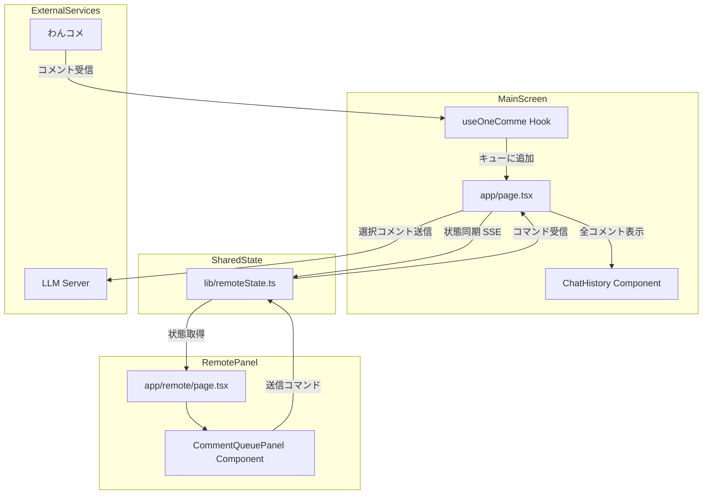
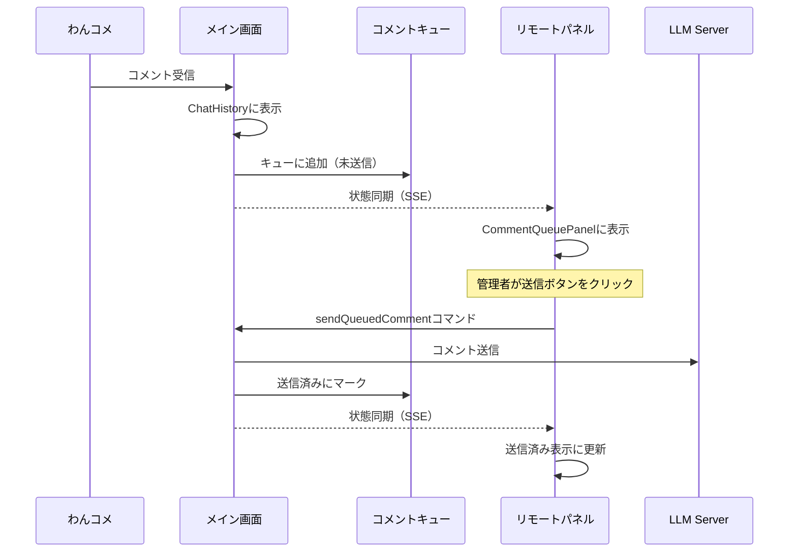
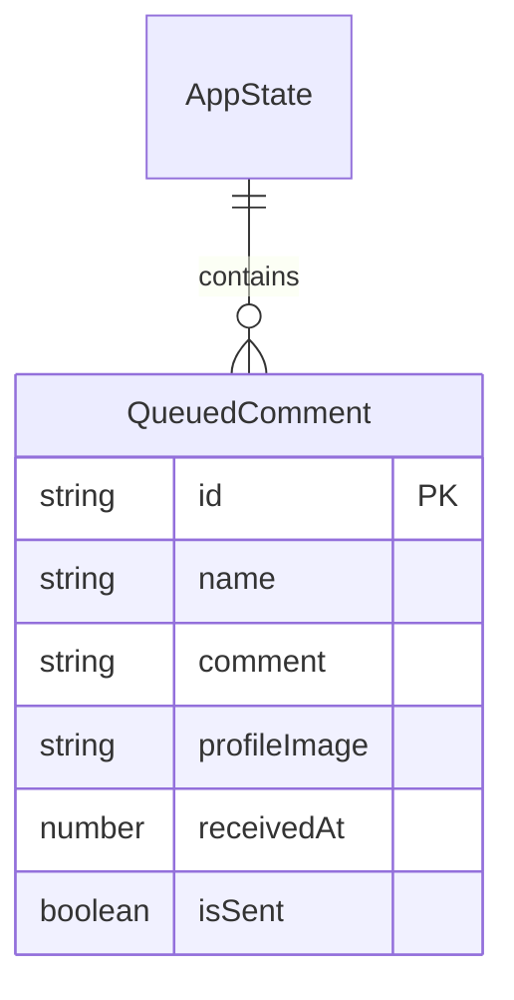

# Design Document

## Overview
**Purpose**: わんコメから取得したコメントをLLMサーバーに即時送信せず、コントロールパネルで管理者が任意のタイミングで送信できるようにする機能を提供する。

**Users**: 配信者（管理者）がコントロールパネルを使用し、視聴者はメイン画面でライブチャットを閲覧する。

**Impact**: 既存のわんコメ連携フローを変更し、コメント受信→即時LLM送信のフローを、コメント受信→キュー追加→手動送信のフローに変更する。

### Goals
- コメントをキューに蓄積し、管理者が選択的にLLMに送信できる
- ワンクリックでの送信操作を実現
- 送信済み/未送信のコメントを視覚的に区別

### Non-Goals
- コメントの自動フィルタリング（NGワード検出など）
- コメントの編集機能
- 複数コメントの一括送信

## Architecture

### Existing Architecture Analysis
- `useOneComme` フックがわんコメからコメントを受信し、`onComment` コールバックで処理
- メイン画面（`app/page.tsx`）が状態を管理し、リモート（`/remote`）にSSE経由で同期
- `lib/remoteState.ts` で `AppState` と `RemoteCommand` を定義

### Architecture Pattern & Boundary Map



**Architecture Integration**:
- Selected pattern: 既存のメイン画面⇔リモートパネル同期パターンを踏襲
- Domain boundaries: コメントキュー状態はメイン画面が所有、リモートは表示とコマンド送信のみ
- Existing patterns preserved: SSE状態同期、RemoteCommand、AppState
- New components rationale: CommentQueuePanelは管理者UIとして必要
- Steering compliance: Next.js App Router構成、TypeScript strict mode

### Technology Stack

| Layer | Choice / Version | Role in Feature | Notes |
|-------|------------------|-----------------|-------|
| Frontend | React 19, Next.js 16 | UIコンポーネント | 既存スタック |
| State | lib/remoteState.ts | コメントキュー状態管理 | 既存拡張 |
| Communication | SSE | メイン画面⇔リモート同期 | 既存パターン |

## System Flows

### コメント受信からLLM送信までのフロー



## Requirements Traceability

| Requirement | Summary | Components | Interfaces | Flows |
|-------------|---------|------------|------------|-------|
| 1.1 | コメントをキュー一覧に追加表示 | CommentQueuePanel, page.tsx | QueuedComment | コメント受信フロー |
| 1.2 | ユーザー名、内容、受信時刻を表示 | CommentQueuePanel | QueuedComment | - |
| 1.3 | コメント件数を表示 | CommentQueuePanel | AppState.commentQueue | - |
| 1.4 | 新しいコメントを上部に追加 | page.tsx | QueuedComment[] | コメント受信フロー |
| 2.1 | LLMへの自動送信を行わない | page.tsx, useOneComme | - | コメント受信フロー |
| 2.2 | メイン画面に通常表示 | ChatHistory | Message | コメント受信フロー |
| 2.3 | 未送信状態として保持 | page.tsx | QueuedComment | - |
| 3.1 | コメントをLLMに送信 | page.tsx | sendQueuedComment | 送信フロー |
| 3.2 | 送信ボタンを表示 | CommentQueuePanel | - | - |
| 3.3 | 確認なしで即座に送信 | CommentQueuePanel, page.tsx | sendQueuedComment | 送信フロー |
| 4.1 | 送信済みとしてマーク | page.tsx | QueuedComment.isSent | 送信フロー |
| 4.2 | 視覚的に区別できるスタイル | CommentQueuePanel | - | - |
| 4.3 | 送信ボタンを非活性 | CommentQueuePanel | QueuedComment.isSent | - |
| 5.1 | メイン画面に送信状態を表示しない | ChatHistory | - | - |
| 5.2 | すべてのコメントを通常表示 | ChatHistory | Message | - |

## Components and Interfaces

| Component | Domain/Layer | Intent | Req Coverage | Key Dependencies | Contracts |
|-----------|--------------|--------|--------------|------------------|-----------|
| CommentQueuePanel | UI/Remote | コメントキューの表示と送信操作 | 1.1-1.4, 3.2, 4.2, 4.3 | useRemoteSync (P0) | State |
| page.tsx (拡張) | UI/Main | コメントキュー状態管理 | 2.1-2.3, 3.1, 3.3, 4.1 | useOneComme (P0) | State, Event |
| remoteState.ts (拡張) | State | コメントキュー状態とコマンド定義 | All | - | State |

### UI Layer

#### CommentQueuePanel

| Field | Detail |
|-------|--------|
| Intent | コントロールパネルでコメントキューを表示し、送信操作を提供 |
| Requirements | 1.1, 1.2, 1.3, 1.4, 3.2, 4.2, 4.3 |

**Responsibilities & Constraints**
- コメントキューの一覧表示（ユーザー名、内容、受信時刻）
- 未送信コメントの送信ボタン表示
- 送信済みコメントの視覚的区別

**Dependencies**
- Inbound: useRemoteSync — 状態取得とコマンド送信 (P0)

**Contracts**: State [x]

##### State Management
- State model: `commentQueue: QueuedComment[]` を `AppState` から取得
- Persistence: メイン画面のメモリ内、SSE経由で同期
- Concurrency: メイン画面が唯一の状態所有者

**Implementation Notes**
- Integration: 既存の `app/remote/page.tsx` のグリッドレイアウトに追加
- Validation: コメント内容が空の場合は表示しない
- Risks: 大量コメント時のスクロールパフォーマンス

### State Layer

#### remoteState.ts (拡張)

| Field | Detail |
|-------|--------|
| Intent | コメントキュー状態とコマンドの型定義 |
| Requirements | All |

**Responsibilities & Constraints**
- `QueuedComment` 型の定義
- `AppState` への `commentQueue` フィールド追加
- `RemoteCommand` への `sendQueuedComment` コマンド追加

**Contracts**: State [x] / Event [x]

##### State Management
```typescript
interface QueuedComment {
  id: string;
  name: string;
  comment: string;
  profileImage?: string;
  receivedAt: number;
  isSent: boolean;
}
```

##### Event Contract
- Published events: 状態変更時にSSE経由で通知（既存パターン）
- Subscribed events: `sendQueuedComment` コマンド受信

**Implementation Notes**
- Integration: 既存の `AppState` と `RemoteCommand` を拡張
- Validation: `id` は `useOneComme` から取得したコメントIDを使用

### Main Page Layer

#### page.tsx (拡張)

| Field | Detail |
|-------|--------|
| Intent | コメントキュー状態の管理とLLM送信制御 |
| Requirements | 2.1, 2.2, 2.3, 3.1, 3.3, 4.1 |

**Responsibilities & Constraints**
- わんコメからのコメントをキューに追加（LLMに送信しない）
- `sendQueuedComment` コマンド受信時にLLM送信を実行
- 送信完了後に `isSent` を `true` に更新

**Dependencies**
- Inbound: useOneComme — コメント受信 (P0)
- Outbound: /api/chat — LLM送信 (P0)
- Outbound: useMainScreenSync — 状態報告 (P0)

**Contracts**: State [x] / Event [x]

##### Event Contract
- Subscribed events: `sendQueuedComment` コマンド（コメントIDを含む）

**Implementation Notes**
- Integration: 既存の `handleOneCommeComment` を変更し、キュー追加のみ行う
- Validation: コメントIDが存在し、未送信の場合のみ送信を実行

## Data Models

### Domain Model



**Entities**:
- `QueuedComment`: キューイングされたコメント（送信状態を含む）

**Business Rules**:
- コメントは受信順にキューに追加（新しいものが先頭）
- 一度送信されたコメントは再送信不可
- メイン画面の `ChatHistory` には送信状態に関係なく全コメントを表示

### Data Contracts & Integration

**API Data Transfer**
- 既存の `/api/chat` APIを使用（変更なし）
- リクエスト: `{ sessionId, username, comment }`

**Event Schemas**
- `sendQueuedComment`: `{ type: 'sendQueuedComment', commentId: string }`

## Error Handling

### Error Categories and Responses
**System Errors**:
- LLM送信失敗 → コメントを未送信状態のまま維持、エラー表示

### Monitoring
- 既存のコンソールログパターンを使用

## Testing Strategy

### Unit Tests
- `QueuedComment` 型の正しい構造
- コメントキューへの追加ロジック
- 送信状態の更新ロジック

### Integration Tests
- コメント受信→キュー追加→送信→状態更新のフロー
- SSE経由の状態同期

### E2E/UI Tests
- CommentQueuePanelの表示
- 送信ボタンクリック→送信済み表示
