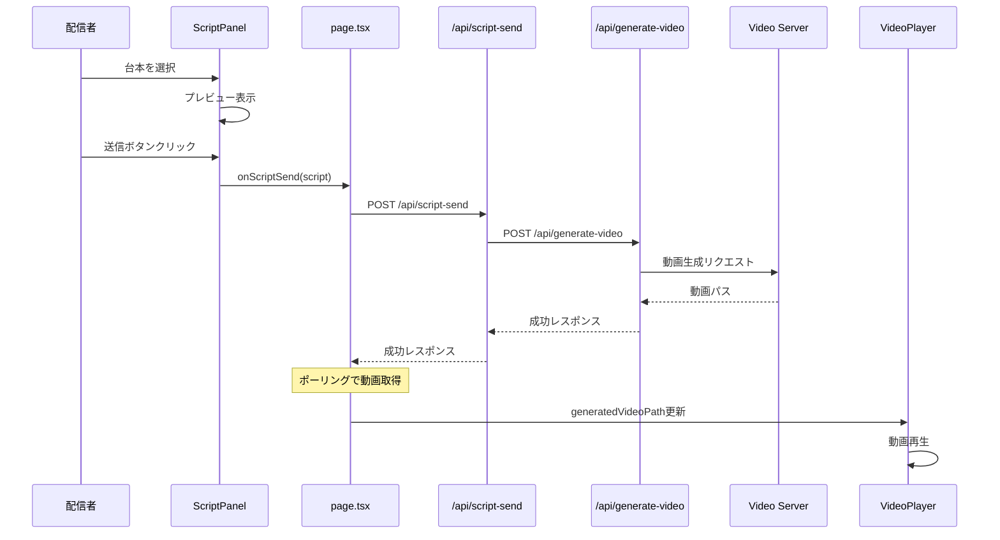
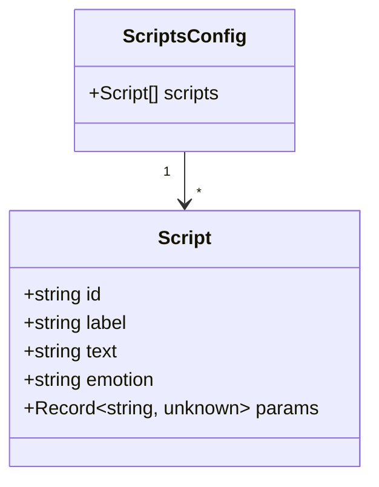

# Design Document: Direct Script Sender

## Overview

**Purpose**: 本機能は、配信者が事前定義した台本データをLLMを経由せず動画生成サーバーに直接送信することで、定型応答（挨拶、締め、リアクション等）を即座に再生できる仕組みを提供する。

**Users**: 配信者がUI上で台本を選択・送信し、AIアバターに即座にセリフを喋らせる。

**Impact**: 既存のLLMチャットフローと並行して動作し、動画生成パイプラインは共有する。

### Goals
- 台本データをJSONファイルで定義・管理できる
- UI上で台本を選択し、ワンクリックで動画生成を開始できる
- 既存のVideoPlayerと連携し、シームレスに動画を再生できる

### Non-Goals
- 台本のリアルタイム編集UI（ファイル編集で対応）
- 複数台本の連続自動再生
- LLMによる台本内容の動的生成

## Architecture

### Existing Architecture Analysis

現在のシステムは以下のフローで動作:
1. ユーザー入力 → `/api/chat` → Mastra Workflow（LLM）→ `/api/generate-video`
2. 動画生成完了 → `/api/generate-video-callback` → ポーリングで取得
3. `VideoPlayer` が `generatedVideoPath` を受け取り再生

本機能では、LLMをバイパスして `/api/generate-video` を直接呼び出す新しいパスを追加する。

### Architecture Pattern & Boundary Map

```mermaid
graph TB
    subgraph Frontend
        ScriptPanel[ScriptPanel]
        Page[page.tsx]
        VideoPlayer[VideoPlayer]
    end

    subgraph API Routes
        ScriptSendAPI[/api/script-send]
        ScriptsAPI[/api/scripts]
        GenerateVideoAPI[/api/generate-video]
    end

    subgraph Config
        ScriptsJSON[/config/scripts.json]
    end

    subgraph External
        VideoServer[Video Generation Server]
    end

    ScriptPanel --> ScriptsAPI
    ScriptsAPI --> ScriptsJSON
    ScriptPanel --> Page
    Page --> ScriptSendAPI
    ScriptSendAPI --> GenerateVideoAPI
    GenerateVideoAPI --> VideoServer
    Page --> VideoPlayer
```

**Architecture Integration**:
- **Selected pattern**: 既存のAPI Route層を経由するレイヤードアーキテクチャ
- **Domain/feature boundaries**: 台本管理（ScriptPanel, scripts API）と動画生成（既存）を分離
- **Existing patterns preserved**: `/api/generate-video` 経由の動画生成、ポーリングによる状態取得
- **New components rationale**: 台本送信の責務を分離するため `/api/script-send` を追加
- **Steering compliance**: Next.js App Router規約、TypeScript strict mode準拠

### Technology Stack

| Layer | Choice / Version | Role in Feature | Notes |
|-------|------------------|-----------------|-------|
| Frontend | React 19 | 台本選択UI（ScriptPanel） | 既存スタック |
| Backend | Next.js API Routes | 台本取得・送信API | 既存スタック |
| Data | JSON（/config/scripts.json） | 台本データ保存 | 既存パターン踏襲 |

## System Flows

### 台本送信フロー



**Key Decisions**:
- 動画生成は非同期で、既存のポーリング機構を再利用
- ScriptPanelからpage.tsxへはコールバックで通知

## Requirements Traceability

| Requirement | Summary | Components | Interfaces | Flows |
|-------------|---------|------------|------------|-------|
| 1.1, 1.2 | 台本データ形式 | ScriptsJSON | Script型 | - |
| 1.3 | 不正形式エラー | ScriptSendAPI | エラーレスポンス | 台本送信フロー |
| 2.1, 2.2 | 直接送信 | ScriptSendAPI | POST /api/script-send | 台本送信フロー |
| 2.3 | VideoPlayer連携 | Page | generatedVideoPath | 台本送信フロー |
| 2.4 | エラー時再試行 | ScriptPanel | isError, retry | 台本送信フロー |
| 3.1 | 台本一覧表示 | ScriptPanel, ScriptsAPI | GET /api/scripts | - |
| 3.2 | プレビュー | ScriptPanel | selectedScript | - |
| 3.3 | 送信ボタン | ScriptPanel | onScriptSend | 台本送信フロー |
| 3.4 | 進行インジケーター | ScriptPanel | isSending | 台本送信フロー |
| 4.1, 4.3 | VideoPlayer統合 | Page, VideoPlayer | generatedVideoPath | 台本送信フロー |
| 4.2 | 既存チャットと独立 | Page | - | - |
| 5.1, 5.2, 5.3 | 設定ファイル管理 | ScriptsJSON, ScriptsAPI | - | - |

## Components and Interfaces

| Component | Domain/Layer | Intent | Req Coverage | Key Dependencies | Contracts |
|-----------|--------------|--------|--------------|------------------|-----------|
| ScriptPanel | UI | 台本選択・送信UI | 3.1-3.4, 2.4 | page.tsx (P0) | State |
| ScriptsAPI | API | 台本一覧取得 | 5.1, 5.3 | scripts.json (P0) | API |
| ScriptSendAPI | API | 台本送信処理 | 2.1-2.3, 1.3 | generate-video API (P0) | API |
| scripts.json | Config | 台本データ保存 | 1.1, 1.2, 5.2 | - | - |

### UI Layer

#### ScriptPanel

| Field | Detail |
|-------|--------|
| Intent | 台本一覧の表示、選択、送信UIを提供 |
| Requirements | 3.1, 3.2, 3.3, 3.4, 2.4 |

**Responsibilities & Constraints**
- 台本一覧の取得と表示
- 選択中の台本のプレビュー
- 送信状態（送信中、エラー）の管理
- 親コンポーネントへの送信通知

**Dependencies**
- Inbound: page.tsx — 親コンポーネント (P0)
- External: /api/scripts — 台本一覧取得 (P0)

**Contracts**: State [x]

##### State Management
```typescript
interface ScriptPanelState {
  scripts: Script[];
  selectedScript: Script | null;
  isLoading: boolean;
  isSending: boolean;
  error: string | null;
}
```

**Implementation Notes**
- Integration: page.tsxに配置、左サイドパネルとして表示
- Validation: 台本が選択されていない場合は送信ボタン無効化
- Risks: API取得失敗時のフォールバック表示が必要

### API Layer

#### ScriptsAPI (`/api/scripts`)

| Field | Detail |
|-------|--------|
| Intent | 設定ファイルから台本一覧を取得 |
| Requirements | 5.1, 5.3 |

**Responsibilities & Constraints**
- `/config/scripts.json` の読み込み
- JSONパース・バリデーション
- エラー時は空配列を返却

**Dependencies**
- External: /config/scripts.json — 台本データファイル (P0)

**Contracts**: API [x]

##### API Contract
| Method | Endpoint | Request | Response | Errors |
|--------|----------|---------|----------|--------|
| GET | /api/scripts | - | `{ scripts: Script[] }` | 500 |

**Implementation Notes**
- Integration: `fs.readFileSync` で同期読み込み（Server Component）
- Validation: JSONスキーマに従わないデータはスキップ
- Risks: ファイル不在時は空配列を返却

#### ScriptSendAPI (`/api/script-send`)

| Field | Detail |
|-------|--------|
| Intent | 台本データを動画生成APIに送信 |
| Requirements | 2.1, 2.2, 1.3 |

**Responsibilities & Constraints**
- 台本データのバリデーション
- VideoRequest形式への変換
- `/api/generate-video` への転送
- エラーハンドリング

**Dependencies**
- Outbound: /api/generate-video — 動画生成 (P0)

**Contracts**: API [x]

##### API Contract
| Method | Endpoint | Request | Response | Errors |
|--------|----------|---------|----------|--------|
| POST | /api/script-send | `ScriptSendRequest` | `ScriptSendResponse` | 400, 500 |

```typescript
interface ScriptSendRequest {
  script: Script;
}

interface ScriptSendResponse {
  success: boolean;
  error?: string;
}
```

**Implementation Notes**
- Integration: 内部で `/api/generate-video` を呼び出し
- Validation: text必須、emotion省略時はデフォルト値
- Risks: generate-video API障害時のエラー伝播

## Data Models

### Domain Model



**Business Rules & Invariants**:
- `id` は一意である必要がある
- `text` は必須フィールド
- `emotion` 省略時は "normal" をデフォルト値として使用

### Logical Data Model

**Structure Definition**:

```typescript
interface Script {
  /** 台本の一意識別子 */
  id: string;
  /** UI表示用ラベル */
  label: string;
  /** 読み上げテキスト */
  text: string;
  /** 感情パラメータ（省略可能） */
  emotion?: string;
  /** 追加パラメータ（拡張用） */
  params?: Record<string, unknown>;
}

interface ScriptsConfig {
  scripts: Script[];
}
```

### Data Contracts & Integration

**API Data Transfer**:

台本送信時、`Script` は以下の `VideoRequest` に変換:

```typescript
// Script → VideoRequest 変換
const videoRequest: VideoRequest = {
  action: 'speak',
  params: {
    text: script.text,
    emotion: script.emotion ?? 'normal',
    ...script.params,
  },
};
```

## Error Handling

### Error Categories and Responses

**User Errors (4xx)**:
- 台本未選択での送信 → UI側でボタン無効化
- 不正な台本形式 → 400エラー、フィールドエラーメッセージ

**System Errors (5xx)**:
- 動画生成API障害 → 500エラー、再試行ボタン表示
- 設定ファイル読み込み失敗 → 空配列返却、UIで案内表示

### Monitoring
- コンソールログでエラー出力（既存パターン踏襲）
- 将来的にエラートラッキング導入を検討

## Testing Strategy

### Unit Tests（将来導入時）
- Script型のバリデーション関数
- Script → VideoRequest 変換ロジック
- エラーハンドリング分岐

### Integration Tests（手動確認）
- `/api/scripts` からの台本取得
- `/api/script-send` → `/api/generate-video` の連携
- 動画生成完了後のVideoPlayer再生

### E2E Tests（手動確認）
- 台本選択 → 送信 → 動画再生の一連フロー
- エラー発生時のUI表示
- 既存チャット機能との併用
