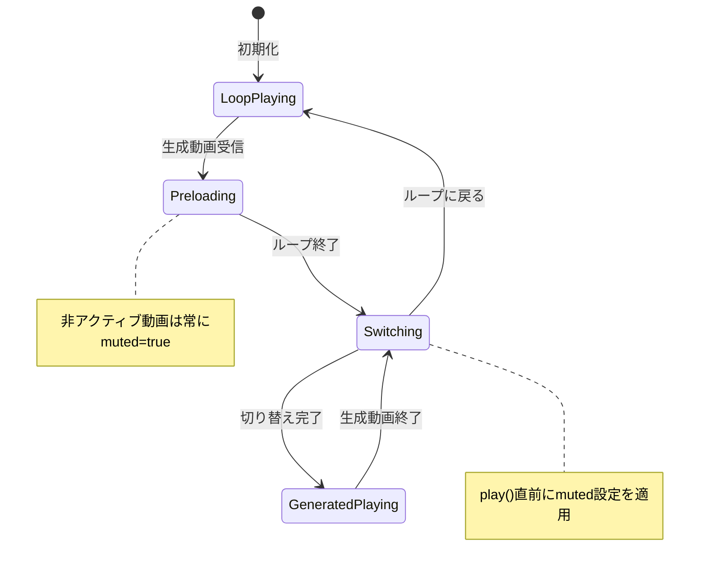
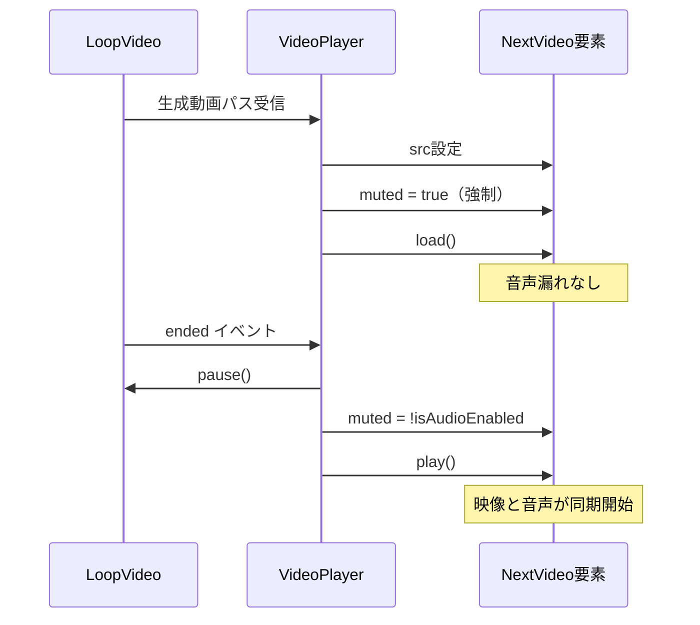

# Design Document

## Overview
**Purpose**: ダブルバッファリングによる動画切り替え時に、事前読み込み中の動画の音声が漏れる不具合を修正し、配信者に自然な視聴体験を提供する。

**Users**: AIアバター配信者が、視聴者に向けた配信で音声の二重再生を防止できる。

**Impact**: VideoPlayerコンポーネントの事前読み込みロジックにおけるミュート制御を修正。

### Goals
- 事前読み込み中の動画要素を常にミュート状態で保持
- 動画切り替え時に映像と音声を同期して切り替え
- 同一動画の音声二重再生を完全に防止

### Non-Goals
- 動画切り替えアニメーションの変更
- 新しい音声制御機能の追加
- Web Audio APIへの移行

## Architecture

### Existing Architecture Analysis
- **現行パターン**: video1, video2によるダブルバッファリング
- **ドメイン境界**: VideoPlayerコンポーネント内で完結
- **維持すべき統合ポイント**: activeVideo状態、opacity制御、isAudioEnabled状態
- **対処する技術的負債**: 事前読み込み時のミュート制御不備

### Architecture Pattern & Boundary Map

**Architecture Integration**:
- Selected pattern: 既存ダブルバッファリングパターンの継続（ミュート制御のみ修正）
- Domain/feature boundaries: VideoPlayerコンポーネント内で完結
- Existing patterns preserved: activeVideo状態管理、opacity切り替え、イベントリスナーパターン
- New components rationale: 新規コンポーネントなし
- Steering compliance: TypeScript strict mode維持、既存パターン踏襲

### Technology Stack

| Layer | Choice / Version | Role in Feature | Notes |
|-------|------------------|-----------------|-------|
| Frontend | React 19 | コンポーネント状態管理 | 既存 |
| UI | HTMLVideoElement | 動画再生・ミュート制御 | Web標準API |

## System Flows

## Requirements Traceability

| Requirement | Summary | Components | Interfaces | Flows |
|-------------|---------|------------|------------|-------|
| 1.1 | 事前読み込み時にミュート設定 | VideoPlayer | preloadVideo | Preloading |
| 1.2 | 再生開始まで音声出力しない | VideoPlayer | - | Preloading |
| 1.3 | 切り替え時に音声設定適用 | VideoPlayer | switchVideo | Switching |
| 2.1 | 映像と音声の同期開始 | VideoPlayer | switchVideo | Switching |
| 2.2 | 前動画の音声停止 | VideoPlayer | switchVideo | Switching |
| 2.3 | ミュート設定の維持 | VideoPlayer | switchVideo | Switching |
| 3.1 | 音声の一回再生 | VideoPlayer | - | All |
| 3.2 | autoplay無効化 | VideoPlayer | JSX | - |
| 3.3 | 停止状態で保持 | VideoPlayer | preloadVideo | Preloading |

## Components and Interfaces

| Component | Domain/Layer | Intent | Req Coverage | Key Dependencies | Contracts |
|-----------|--------------|--------|--------------|------------------|-----------|
| VideoPlayer | UI | 動画再生とミュート制御 | 1.1-3.3 | HTMLVideoElement (P0) | State |

### UI Layer

#### VideoPlayer

| Field | Detail |
|-------|--------|
| Intent | ダブルバッファリングによる動画再生とミュート制御 |
| Requirements | 1.1, 1.2, 1.3, 2.1, 2.2, 2.3, 3.1, 3.2, 3.3 |

**Responsibilities & Constraints**
- 事前読み込み中の動画要素を常にミュート状態で保持
- 切り替え実行時のみユーザーの音声設定を適用
- 映像表示と音声再生を同一タイミングで開始

**Dependencies**
- External: HTMLVideoElement — 動画再生・ミュート制御 (P0)

**Contracts**: State [x]

##### State Management
- State model:
  - `isAudioEnabled: boolean` — ユーザーの音声設定（既存）
  - 非アクティブ動画要素: 常に `muted = true`
  - アクティブ動画要素: `muted = !isAudioEnabled`

- Persistence & consistency:
  - 事前読み込み時: `nextVideo.muted = true`（強制）
  - 切り替え実行時: `nextVideo.muted = !isAudioEnabled`（設定適用）

- Concurrency strategy: シングルスレッド（React状態管理）

**Implementation Notes**
- Integration: 221行目の `nextVideo.muted = !isAudioEnabled` を `nextVideo.muted = true` に変更
- Validation: 事前読み込み後も `muted` が `true` であることを確認
- Risks: 切り替え時の `muted` 設定漏れに注意（268行目は既存のまま維持）

## Error Handling

### Error Strategy
既存のエラーハンドリング（load再試行）を維持。ミュート制御はエラーを発生させない。

### Error Categories and Responses
**System Errors**: 動画読み込み失敗 → 既存の再試行ロジックで対応（変更なし）

## Testing Strategy

### Unit Tests
- 事前読み込み時に `muted = true` が設定されることを確認
- 切り替え時に `muted = !isAudioEnabled` が適用されることを確認
- `isAudioEnabled = false` の場合、切り替え後も `muted = true` であることを確認

### Integration Tests
- ループ動画→生成動画の切り替えで音声が同期することを確認
- 生成動画→ループ動画の切り替えで音声が停止することを確認
- 連続した生成動画の切り替えで音声漏れがないことを確認

### E2E/UI Tests
- 実際の配信画面で音声の二重再生が発生しないことを確認
- ユーザーインタラクション後の音声有効化が正常に動作することを確認
