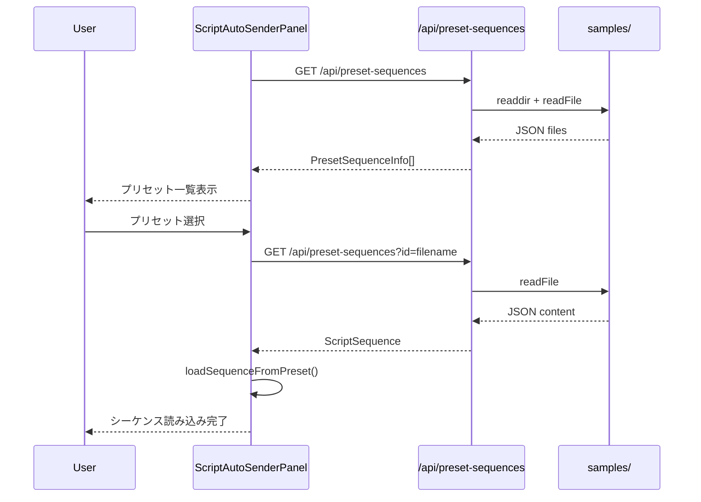
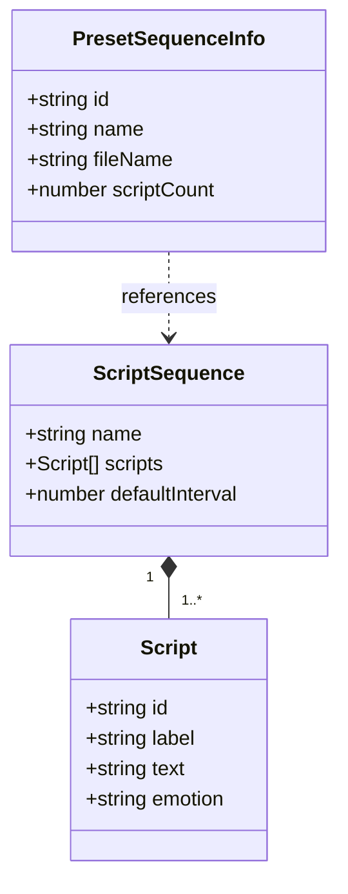

# Design Document: preset-sequence-sender

## Overview

**Purpose**: リモート操作パネルの自動送信機能を拡張し、`samples/`フォルダ内のプリセットシーケンスファイルをワンクリックで選択・送信できるようにする。

**Users**: 配信者がリモート操作パネルから素早くシーケンスを選択し、配信準備時間を短縮する。

**Impact**: 既存の`ScriptAutoSenderPanel`コンポーネントと`useScriptAutoSender`フックを拡張し、新規APIエンドポイントを追加する。

### Goals
- `samples/`フォルダ内のシーケンスファイルを自動検出して一覧表示
- プリセット選択によるワンクリックでのシーケンス読み込み
- 既存のファイル選択機能との共存

### Non-Goals
- プリセットファイルの編集・作成機能
- フォルダ階層のサポート（フラット構造のみ）
- リアルタイムのファイル監視（手動更新のみ）

## Architecture

### Existing Architecture Analysis
- `ScriptAutoSenderPanel`: ファイル選択UIと自動送信制御を提供
- `useScriptAutoSender`: シーケンス状態管理と送信ロジックを担当
- `/api/scripts`: 設定ファイルからの台本読み込みパターンが確立

### Architecture Pattern & Boundary Map

```mermaid
graph TB
    subgraph Client
        RemotePage[RemoteControlPage]
        Panel[ScriptAutoSenderPanel]
        Hook[useScriptAutoSender]
    end

    subgraph API
        PresetAPI[/api/preset-sequences]
    end

    subgraph FileSystem
        Samples[samples/]
    end

    RemotePage --> Panel
    Panel --> Hook
    Panel --> PresetAPI
    PresetAPI --> Samples
    Hook --> Panel
```

**Architecture Integration**:
- Selected pattern: 既存コンポーネント拡張 + 新規APIエンドポイント
- Domain boundaries: UIレイヤー（Panel）、ロジックレイヤー（Hook）、データレイヤー（API）の分離を維持
- Existing patterns preserved: ファイルシステムからのJSON読み込みパターン（`/api/scripts`と同様）
- New components rationale: プリセット一覧取得APIのみ新規追加、既存コンポーネントは拡張

### Technology Stack

| Layer | Choice / Version | Role in Feature | Notes |
|-------|------------------|-----------------|-------|
| Frontend | React 19 | プリセット一覧UI表示 | 既存 |
| Backend | Next.js 16 App Router | APIエンドポイント提供 | 既存 |
| Data | File System (fs) | JSONファイル読み込み | 既存パターン流用 |

## System Flows

### プリセット選択フロー



## Requirements Traceability

| Requirement | Summary | Components | Interfaces | Flows |
|-------------|---------|------------|------------|-------|
| 1.1 | ページ読み込み時にプリセット一覧取得 | ScriptAutoSenderPanel | PresetSequencesAPI.GET | プリセット選択フロー |
| 1.2 | シーケンス名表示 | ScriptAutoSenderPanel | PresetSequenceInfo | - |
| 1.3 | プリセット不在時メッセージ | ScriptAutoSenderPanel | - | - |
| 1.4 | 台本件数表示 | ScriptAutoSenderPanel | PresetSequenceInfo | - |
| 2.1 | プリセット選択で読み込み | ScriptAutoSenderPanel, useScriptAutoSender | loadSequenceFromPreset | プリセット選択フロー |
| 2.2 | ローディング状態表示 | ScriptAutoSenderPanel | presetLoadingId | - |
| 2.3 | 読み込み完了後の制御UI | ScriptAutoSenderPanel | - | - |
| 2.4 | 読み込みエラー表示 | ScriptAutoSenderPanel | error state | - |
| 3.1 | 更新ボタン表示 | ScriptAutoSenderPanel | - | - |
| 3.2 | 更新ボタンで再取得 | ScriptAutoSenderPanel | refetchPresets | - |
| 3.3 | 更新中はボタン無効化 | ScriptAutoSenderPanel | isRefetching | - |
| 4.1 | ファイル選択ボタン維持 | ScriptAutoSenderPanel | - | - |
| 4.2 | ファイル選択でプリセット状態クリア | ScriptAutoSenderPanel | - | - |
| 4.3 | プリセット選択でファイル状態クリア | ScriptAutoSenderPanel | - | - |
| 5.1 | プリセット一覧API | PresetSequencesAPI | GET /api/preset-sequences | - |
| 5.2 | ファイル名・シーケンス名・件数返却 | PresetSequencesAPI | PresetSequenceInfo | - |
| 5.3 | コンテンツ取得用ID提供 | PresetSequencesAPI | PresetSequenceInfo.id | - |
| 5.4 | 個別シーケンス取得 | PresetSequencesAPI | GET ?id=filename | プリセット選択フロー |

## Components and Interfaces

| Component | Domain/Layer | Intent | Req Coverage | Key Dependencies | Contracts |
|-----------|--------------|--------|--------------|------------------|-----------|
| PresetSequencesAPI | API | プリセット一覧・詳細取得 | 5.1-5.4 | fs (P0) | API |
| ScriptAutoSenderPanel | UI | プリセット選択UI | 1.1-4.3 | useScriptAutoSender (P0), PresetSequencesAPI (P0) | State |
| useScriptAutoSender | Hook | シーケンス読み込み拡張 | 2.1 | - | Service |

### API Layer

#### PresetSequencesAPI

| Field | Detail |
|-------|--------|
| Intent | `samples/`フォルダからプリセットシーケンス一覧と詳細を提供 |
| Requirements | 5.1, 5.2, 5.3, 5.4 |

**Responsibilities & Constraints**
- `samples/`フォルダ内のJSONファイルをスキャン
- 各ファイルからメタ情報（名前、件数）を抽出
- 個別ファイルの完全な内容を返却

**Dependencies**
- External: fs (Node.js) — ファイルシステムアクセス (P0)

**Contracts**: API [x]

##### API Contract

| Method | Endpoint | Request | Response | Errors |
|--------|----------|---------|----------|--------|
| GET | /api/preset-sequences | - | `{ presets: PresetSequenceInfo[] }` | 500 |
| GET | /api/preset-sequences?id={id} | id: string | `ScriptSequence` | 404, 500 |

**Implementation Notes**
- Integration: 既存の`/api/scripts`パターンに準拠
- Validation: `parseScriptSequence`を使用してJSONバリデーション
- Risks: ファイル数が多い場合のパフォーマンス（初期は考慮せず）

### UI Layer

#### ScriptAutoSenderPanel（拡張）

| Field | Detail |
|-------|--------|
| Intent | プリセット一覧表示と選択UIを既存パネルに追加 |
| Requirements | 1.1-1.4, 2.1-2.4, 3.1-3.3, 4.1-4.3 |

**Responsibilities & Constraints**
- コンポーネントマウント時にプリセット一覧を取得
- プリセット選択状態とファイル選択状態の排他管理
- ローディング・エラー状態の表示

**Dependencies**
- Inbound: RemoteControlPage — 親コンポーネント (P0)
- Outbound: useScriptAutoSender — シーケンス読み込み (P0)
- External: /api/preset-sequences — プリセット取得 (P0)

**Contracts**: State [x]

##### State Management
- `presets: PresetSequenceInfo[]` — プリセット一覧
- `isLoadingPresets: boolean` — 一覧取得中
- `presetLoadingId: string | null` — 詳細取得中のプリセットID
- `selectedPresetId: string | null` — 選択中のプリセットID

**Implementation Notes**
- Integration: 既存のファイル選択UIの上部にプリセット一覧を配置
- Validation: プリセット選択時は`clearSequence()`を呼んでから読み込み
- Risks: UI複雑化（プリセット一覧は折りたたみ可能にすることを検討）

### Hook Layer

#### useScriptAutoSender（拡張）

| Field | Detail |
|-------|--------|
| Intent | API経由でのシーケンス読み込み機能を追加 |
| Requirements | 2.1 |

**Responsibilities & Constraints**
- 既存の`loadSequence(file: File)`に加え、`loadSequenceFromData(data: ScriptSequence)`を追加
- パース済みデータを直接受け取り、状態を更新

**Dependencies**
- Inbound: ScriptAutoSenderPanel — 呼び出し元 (P0)

**Contracts**: Service [x]

##### Service Interface
```typescript
interface AutoSenderActionsExtended extends AutoSenderActions {
  /** パース済みシーケンスデータを直接読み込む */
  loadSequenceFromData: (data: ScriptSequence) => void;
}
```
- Preconditions: dataは有効な`ScriptSequence`型
- Postconditions: `sequence`状態が更新され、`status`が`idle`になる
- Invariants: 既存の`loadSequence`と同様の状態遷移

**Implementation Notes**
- Integration: 既存の`loadSequence`内のパース後処理を共通化
- Validation: 呼び出し元でバリデーション済みを前提（API側でバリデーション済み）

## Data Models

### Domain Model



### Data Contracts & Integration

**API Response Schema**

```typescript
/** プリセット一覧のレスポンス */
interface PresetSequencesResponse {
  presets: PresetSequenceInfo[];
}

/** プリセットメタ情報 */
interface PresetSequenceInfo {
  /** ファイル識別子（拡張子なしファイル名） */
  id: string;
  /** シーケンス名（JSONのnameフィールド、なければファイル名） */
  name: string;
  /** ファイル名（拡張子付き） */
  fileName: string;
  /** 台本件数 */
  scriptCount: number;
}
```

## Error Handling

### Error Categories and Responses

**User Errors (4xx)**:
- 404: 指定されたプリセットIDが存在しない → 「プリセットが見つかりません」

**System Errors (5xx)**:
- 500: ファイル読み込み失敗 → 空配列を返却（一覧）、エラーメッセージ（詳細）

**Business Logic Errors (422)**:
- JSONパースエラー → ログ出力、該当ファイルをスキップ

### Monitoring
- コンソールログでエラー出力（既存パターンに準拠）

## Testing Strategy

### Unit Tests
- `parseScriptSequence`: 既存テストを流用
- `PresetSequenceInfo`の生成ロジック

### Integration Tests
- `/api/preset-sequences` GET: 一覧取得
- `/api/preset-sequences?id=xxx` GET: 詳細取得、404ケース

### E2E/UI Tests
- プリセット一覧表示
- プリセット選択→シーケンス読み込み→開始
- ファイル選択との排他動作
