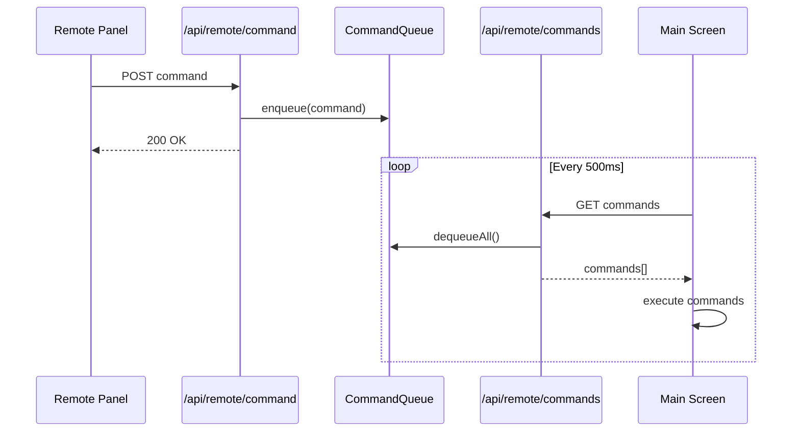
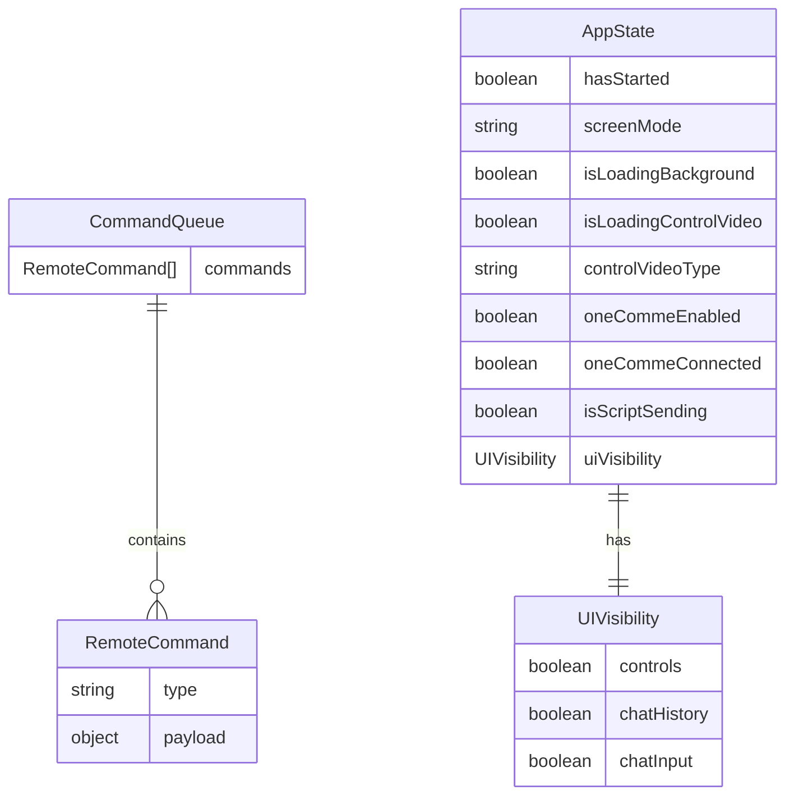

# Design Document: reliable-remote-control

## Overview
**Purpose**: リモート操作パネルからメイン画面へのコマンド伝達を確実にするため、SSEベースの通信をポーリング+コマンドキュー方式に置き換える。

**Users**: 配信者がリモートパネルから配信画面を操作する際に使用。

**Impact**: 既存のSSEエンドポイント（`/api/remote/events`）を削除し、ポーリング方式に移行。UIコンポーネントへの影響なし（フックが抽象化）。

### Goals
- コマンドの確実な配信（取りこぼし防止）
- シンプルで理解しやすい実装
- 既存機能の完全維持

### Non-Goals
- リアルタイム性の向上（500ms〜1秒の遅延は許容）
- セキュリティ強化（ローカル環境限定）
- 複雑な再接続ロジック

## Architecture

### Existing Architecture Analysis
現在のシステムはSSE（Server-Sent Events）を使用してリモートパネルとメイン画面を同期している。

**問題点**:
- SSE接続が切れるとコマンドが失われる
- `broadcastCommand`はメモリ上のSubscriberにのみ配信、永続化なし
- 再接続時に未処理コマンドを復元する仕組みがない

**維持するパターン**:
- `/api/remote/state` による状態管理
- `/api/remote/command` によるコマンド送信
- `lib/remoteState.ts` のインメモリ状態管理

### Architecture Pattern & Boundary Map

```mermaid
graph TB
    subgraph RemotePanel
        RP[Remote Page]
        URS[useRemoteSyncPolling]
    end

    subgraph Server
        CMD[/api/remote/command]
        CMDS[/api/remote/commands]
        STATE[/api/remote/state]
        RS[remoteState.ts]
        CQ[CommandQueue]
    end

    subgraph MainScreen
        MS[Main Page]
        UMS[useMainScreenSyncPolling]
    end

    RP --> URS
    URS -->|POST command| CMD
    URS -->|GET state 500ms| STATE
    CMD --> RS
    CMD -->|enqueue| CQ
    STATE --> RS

    MS --> UMS
    UMS -->|GET commands 500ms| CMDS
    UMS -->|POST state| STATE
    CMDS -->|dequeue| CQ
    STATE --> RS
```

**Architecture Integration**:
- Selected pattern: ポーリング+コマンドキュー（シンプルで確実）
- Domain boundaries: リモートパネル / サーバー / メイン画面の3層
- Existing patterns preserved: 状態管理、コマンド送信APIは維持
- New components: CommandQueue（インメモリFIFOキュー）
- Steering compliance: Next.js API Routes、TypeScript strict mode維持

### Technology Stack

| Layer | Choice / Version | Role in Feature | Notes |
|-------|------------------|-----------------|-------|
| Frontend | React 19, Next.js 16 | ポーリングフック | 変更なし |
| Backend | Next.js API Routes | コマンドキューAPI | 新規エンドポイント追加 |
| Data | インメモリ配列 | コマンドキュー保持 | remoteState.ts拡張 |

## System Flows

### コマンド送信〜実行フロー



**Key Decisions**:
- コマンド送信は即座にキューに追加、200 OKを返す
- メイン画面は500ms間隔でキューを取得し、取得したコマンドは削除
- 複数コマンドがあれば一度に取得・実行（FIFO順序保証）

## Requirements Traceability

| Requirement | Summary | Components | Interfaces | Flows |
|-------------|---------|------------|------------|-------|
| 1.1 | SSEからポーリングへ移行 | useRemoteSyncPolling, useMainScreenSyncPolling | GET /api/remote/commands | コマンド送信〜実行 |
| 1.2 | 1秒以内のコマンド受信 | useMainScreenSyncPolling | - | 500msポーリング |
| 1.3 | コマンドキュー保持 | CommandQueue | - | - |
| 1.4 | 取得時にキュー削除 | CommandQueue | GET /api/remote/commands | - |
| 2.1 | キューへのコマンド追加 | CommandQueue | POST /api/remote/command | - |
| 2.2 | ポーリングでコマンド取得 | useMainScreenSyncPolling | GET /api/remote/commands | - |
| 2.3 | 取得成功時にキュー削除 | CommandQueue | - | - |
| 2.4 | FIFO順序保証 | CommandQueue | - | - |
| 3.1 | 状態変更時の報告 | useMainScreenSyncPolling | POST /api/remote/state | - |
| 3.2 | ポーリングで状態取得 | useRemoteSyncPolling | GET /api/remote/state | - |
| 3.3 | 失敗時の再試行 | useRemoteSyncPolling | - | - |
| 3.4 | 500ms間隔ポーリング | useRemoteSyncPolling | - | - |
| 4.1 | コマンド送信失敗時の再送 | useRemoteSyncPolling | - | - |
| 4.2 | ポーリング失敗時の再試行 | useMainScreenSyncPolling | - | - |
| 4.3 | エラー時UIブロックなし | useRemoteSyncPolling, useMainScreenSyncPolling | - | - |
| 4.4 | 接続回復時の復帰 | useRemoteSyncPolling, useMainScreenSyncPolling | - | - |
| 5.1-5.5 | 既存機能維持 | 全コンポーネント | 既存API | - |

## Components and Interfaces

| Component | Domain/Layer | Intent | Req Coverage | Key Dependencies | Contracts |
|-----------|--------------|--------|--------------|------------------|-----------|
| CommandQueue | Server/Data | コマンドのFIFOキュー管理 | 1.3, 1.4, 2.1, 2.3, 2.4 | - | State |
| useRemoteSyncPolling | Remote/Hook | リモートパネル用ポーリング | 3.2, 3.3, 3.4, 4.1, 4.3 | CommandQueue (P0) | Service |
| useMainScreenSyncPolling | Main/Hook | メイン画面用ポーリング | 1.1, 1.2, 2.2, 3.1, 4.2, 4.3, 4.4 | CommandQueue (P0) | Service |
| /api/remote/commands | Server/API | コマンドキュー取得 | 1.1, 1.4, 2.2, 2.3 | CommandQueue (P0) | API |

### Server / Data

#### CommandQueue

| Field | Detail |
|-------|--------|
| Intent | コマンドをFIFO順序で保持し、取得時に削除する |
| Requirements | 1.3, 1.4, 2.1, 2.3, 2.4 |

**Responsibilities & Constraints**
- コマンドのエンキュー（追加）
- コマンドのデキュー（取得+削除）
- FIFO順序の保証
- 最大100件の制限（オーバーフロー時は古いものから削除）

**Dependencies**
- Inbound: `/api/remote/command` — コマンド追加 (P0)
- Inbound: `/api/remote/commands` — コマンド取得 (P0)

**Contracts**: State [x]

##### State Management
```typescript
interface CommandQueueState {
  commands: RemoteCommand[];
}

// lib/remoteState.ts に追加
function enqueueCommand(command: RemoteCommand): void;
function dequeueAllCommands(): RemoteCommand[];
```
- State model: インメモリ配列
- Persistence: なし（サーバー再起動でクリア）
- Concurrency: シングルスレッド（Next.js API Routes）

### Server / API

#### /api/remote/commands

| Field | Detail |
|-------|--------|
| Intent | 未処理コマンドを取得し、キューから削除する |
| Requirements | 1.1, 1.4, 2.2, 2.3 |

**Responsibilities & Constraints**
- GETリクエストでキュー内の全コマンドを返却
- 返却したコマンドはキューから削除
- 空の場合は空配列を返却

**Dependencies**
- Inbound: useMainScreenSyncPolling — ポーリング (P0)
- Outbound: CommandQueue — コマンド取得 (P0)

**Contracts**: API [x]

##### API Contract
| Method | Endpoint | Request | Response | Errors |
|--------|----------|---------|----------|--------|
| GET | /api/remote/commands | - | `{ commands: RemoteCommand[] }` | 500 |

### Remote / Hook

#### useRemoteSyncPolling

| Field | Detail |
|-------|--------|
| Intent | リモートパネル用の状態取得とコマンド送信 |
| Requirements | 3.2, 3.3, 3.4, 4.1, 4.3 |

**Responsibilities & Constraints**
- 500ms間隔で状態をポーリング
- コマンド送信（失敗時は再試行）
- エラー時もUIをブロックしない

**Dependencies**
- Outbound: `/api/remote/state` — 状態取得 (P0)
- Outbound: `/api/remote/command` — コマンド送信 (P0)

**Contracts**: Service [x]

##### Service Interface
```typescript
interface UseRemoteSyncPollingReturn {
  state: AppState | null;
  isConnected: boolean;
  error: string | null;
  sendCommand: (command: RemoteCommand) => Promise<void>;
}

function useRemoteSyncPolling(): UseRemoteSyncPollingReturn;
```
- Preconditions: なし
- Postconditions: 状態が定期的に更新される
- Invariants: エラー時もisConnected/errorで状態表示

### Main / Hook

#### useMainScreenSyncPolling

| Field | Detail |
|-------|--------|
| Intent | メイン画面用のコマンド受信と状態報告 |
| Requirements | 1.1, 1.2, 2.2, 3.1, 4.2, 4.3, 4.4 |

**Responsibilities & Constraints**
- 500ms間隔でコマンドをポーリング
- 受信したコマンドを即座に実行
- 状態変更時にサーバーに報告
- エラー時もUIをブロックしない

**Dependencies**
- Outbound: `/api/remote/commands` — コマンド取得 (P0)
- Outbound: `/api/remote/state` — 状態報告 (P0)

**Contracts**: Service [x]

##### Service Interface
```typescript
interface UseMainScreenSyncPollingOptions {
  onSelectMode: (mode: 'standby' | 'room') => void;
  onControlVideo: (action: 'start' | 'end') => void;
  onToggleOneComme: (enabled: boolean) => void;
  onUIVisibilityChange: (target: 'controls' | 'chatHistory' | 'chatInput', visible: boolean) => void;
  onSendScript?: (script: Script) => void;
}

interface UseMainScreenSyncPollingReturn {
  isConnected: boolean;
  error: string | null;
  reportState: (state: AppState) => Promise<void>;
}

function useMainScreenSyncPolling(options: UseMainScreenSyncPollingOptions): UseMainScreenSyncPollingReturn;
```
- Preconditions: コールバック関数が提供される
- Postconditions: コマンドがコールバック経由で実行される
- Invariants: FIFO順序でコマンドを処理

## Data Models

### Domain Model



### Logical Data Model

**RemoteCommand（既存、変更なし）**:
```typescript
type RemoteCommand =
  | { type: 'selectMode'; mode: 'standby' | 'room' }
  | { type: 'controlVideo'; action: 'start' | 'end' }
  | { type: 'sendScript'; script: Script }
  | { type: 'toggleOneComme'; enabled: boolean }
  | { type: 'setUIVisibility'; target: 'controls' | 'chatHistory' | 'chatInput'; visible: boolean };
```

**CommandQueue（新規追加）**:
- 配列による単純なFIFOキュー
- 最大100件制限
- インメモリ管理

## Error Handling

### Error Strategy
- **Fail Soft**: エラー時も操作継続可能
- **Silent Retry**: バックグラウンドで自動リトライ
- **User Notification**: 持続的エラー時のみ表示

### Error Categories and Responses
**Network Errors** (fetch失敗): 次のポーリングで自動リトライ、UIブロックなし
**Server Errors** (5xx): エラーログ記録、次のポーリングで再試行
**Validation Errors** (4xx): コンソールログ、コマンド破棄

### Monitoring
- `console.error`でエラーログ
- `isConnected`/`error`状態でUI表示

## Testing Strategy

### Unit Tests
- CommandQueue: enqueue/dequeue/FIFO順序/上限テスト
- useRemoteSyncPolling: ポーリング開始/停止/エラーハンドリング
- useMainScreenSyncPolling: コマンド実行/状態報告

### Integration Tests
- コマンド送信→キュー追加→取得→実行の一連フロー
- 複数コマンドの順序保証
- エラー時の復旧動作

### E2E Tests
- リモートパネルからの開始/終了ボタン操作
- 台本送信
- 状態同期の確認
