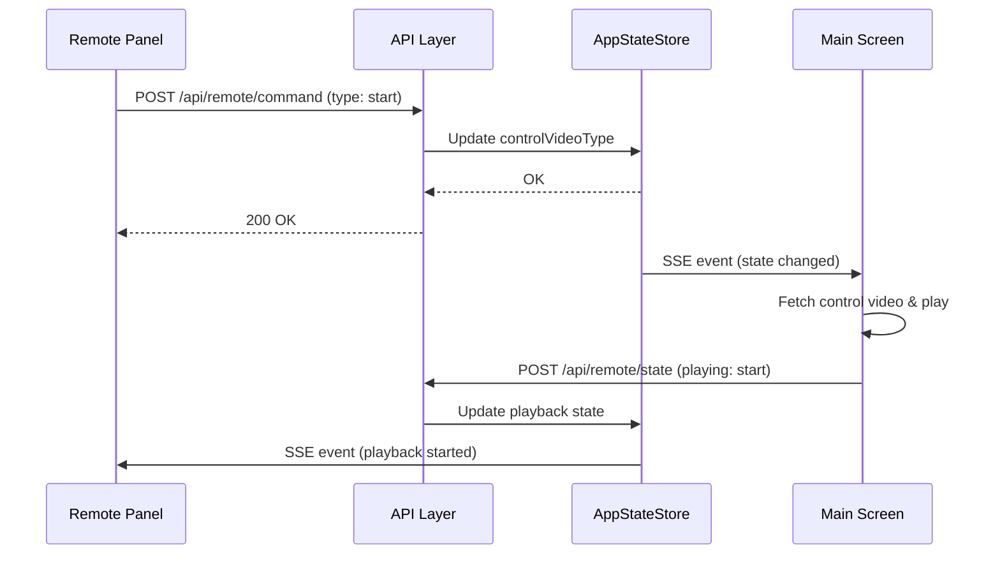
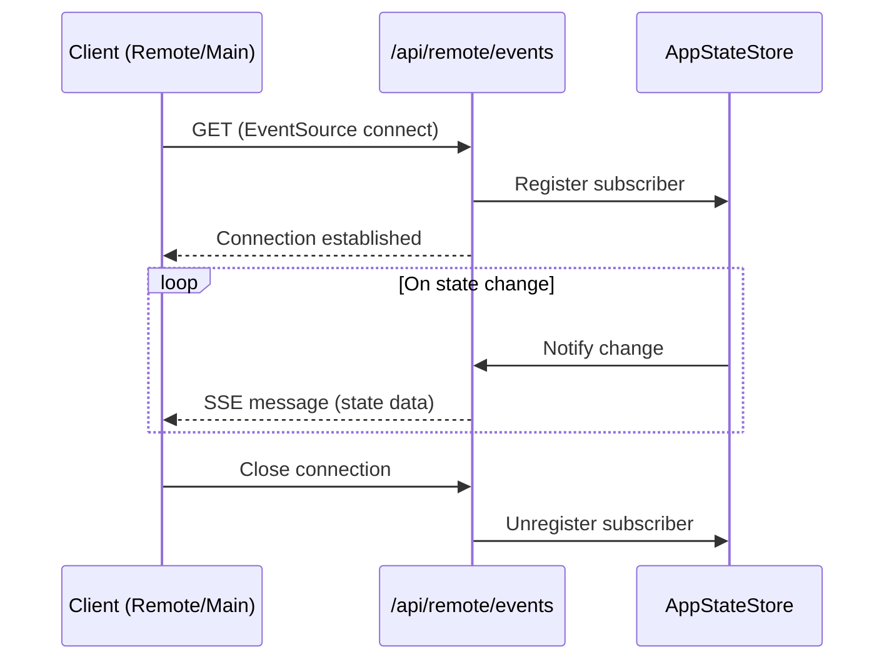
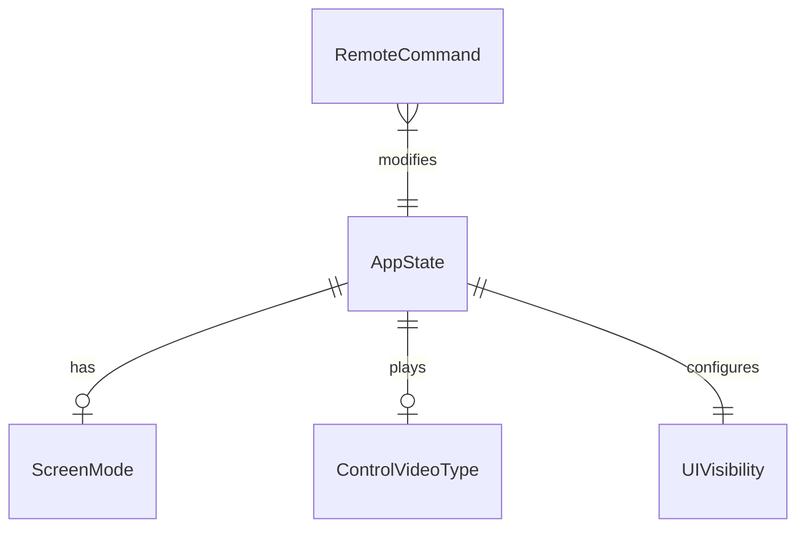

# Design Document: Remote Control Panel

## Overview

**Purpose**: 本機能は配信者がメイン画面（視聴者向け）を表示しながら、別ウィンドウ/デバイスから配信を操作できるリモート操作パネルを提供する。

**Users**: 配信者がタブレット・スマートフォン・別PCから配信の開始/終了、台本送信、わんコメ連携などを操作する。

**Impact**: 既存のメイン画面コンポーネントを操作UI表示オプション付きで拡張し、新規の `/remote` ページと状態同期APIを追加する。

### Goals
- リモートパネルからすべての配信操作が可能
- メイン画面とリモートパネル間のリアルタイム状態同期
- メイン画面の操作UIを非表示にするオプション

### Non-Goals
- 動画のプレビュー表示（リモート側での動画再生は対象外）
- 複数リモートパネルの同時接続管理
- 認証・アクセス制限（将来的な拡張）

## Architecture

### Existing Architecture Analysis
- **現行パターン**: React Hooks による状態管理、ポーリングによる動画生成状態取得
- **維持すべき境界**: `app/page.tsx` のコンポーネント構成、`/api/` のREST API構造
- **統合ポイント**: 既存の設定API、台本API、動画生成コールバックAPI

### Architecture Pattern & Boundary Map

```mermaid
graph TB
    subgraph RemotePanel[Remote Panel - /remote]
        RC[RemoteControlPage]
        RC --> ModeSelect[ModeSelector]
        RC --> ControlBtns[ControlButtons]
        RC --> ScriptSend[ScriptPanel]
        RC --> StatusDisp[StatusDisplay]
    end

    subgraph MainScreen[Main Screen - /]
        MS[HomePage]
        MS --> VP[VideoPlayer]
        MS --> CH[ChatHistory]
        MS --> CI[ChatInput]
    end

    subgraph API[API Layer]
        StateAPI[/api/remote/state]
        CommandAPI[/api/remote/command]
        SSE[/api/remote/events - SSE]
    end

    subgraph SharedState[Server State]
        AppState[AppStateStore]
    end

    RC -->|POST command| CommandAPI
    RC -->|SSE subscribe| SSE
    MS -->|POST state update| StateAPI
    MS -->|SSE subscribe| SSE
    CommandAPI --> AppState
    StateAPI --> AppState
    SSE --> AppState
```

**Architecture Integration**:
- **Selected pattern**: SSE + REST API（単方向プッシュ + RESTコマンド）
- **Domain boundaries**: リモートパネル（操作UI）、メイン画面（表示）、API層（状態中継）
- **Existing patterns preserved**: React Hooks、ポーリング（動画生成状態）、既存API構造
- **New components rationale**: 状態同期API、リモートページが必要
- **Steering compliance**: Next.js App Router、TypeScript strict mode

### Technology Stack

| Layer | Choice / Version | Role in Feature | Notes |
|-------|------------------|-----------------|-------|
| Frontend | React 19, Next.js 16 | リモートページUI、SSEクライアント | 既存スタック |
| Backend | Next.js API Routes | 状態同期API、SSEエンドポイント | 既存パターン |
| Data | インメモリMap | 共有状態管理 | 既存パターン踏襲 |
| Messaging | Server-Sent Events | リアルタイム状態プッシュ | 新規追加 |

## System Flows

### リモートパネルからの操作フロー



### SSE接続フロー



## Requirements Traceability

| Requirement | Summary | Components | Interfaces | Flows |
|-------------|---------|------------|------------|-------|
| 1.1 | リモートページ提供 | RemoteControlPage | - | - |
| 1.2 | 操作ボタン表示 | ControlButtons | - | - |
| 1.3 | 台本パネル表示 | ScriptPanel（既存再利用） | - | - |
| 1.4 | わんコメ切替 | OneCommeToggle | CommandAPI | - |
| 2.1 | 開始動画再生 | ControlButtons, HomePage | CommandAPI | 操作フロー |
| 2.2 | 終了動画再生 | ControlButtons, HomePage | CommandAPI | 操作フロー |
| 2.3 | 台本送信反映 | ScriptPanel, HomePage | CommandAPI | 操作フロー |
| 2.4 | わんコメ連携反映 | OneCommeToggle, HomePage | CommandAPI | - |
| 2.5 | 状態表示 | StatusDisplay | SSE | SSE接続フロー |
| 3.1 | モード選択UI | ModeSelector | CommandAPI | - |
| 3.2 | モード選択反映 | ModeSelector, HomePage | CommandAPI, SSE | - |
| 3.3 | 現在モード表示 | StatusDisplay | SSE | - |
| 4.1 | 接続状態表示 | ConnectionStatus | SSE | SSE接続フロー |
| 4.2 | ローディング表示 | StatusDisplay | SSE | - |
| 4.3 | 再生中アクション表示 | StatusDisplay | SSE | - |
| 4.4 | 再接続処理 | useRemoteSync hook | SSE | SSE接続フロー |
| 5.1 | UI非表示オプション | HomePage | SSE | - |
| 5.2 | チャット履歴切替 | HomePage | CommandAPI | - |
| 5.3 | チャット入力切替 | HomePage | CommandAPI | - |

## Components and Interfaces

### Component Summary

| Component | Domain/Layer | Intent | Req Coverage | Key Dependencies | Contracts |
|-----------|--------------|--------|--------------|------------------|-----------|
| RemoteControlPage | UI/Page | リモート操作ページ | 1.1-1.4 | AppStateStore (P0) | State |
| ModeSelector | UI | 画面モード選択 | 3.1-3.3 | CommandAPI (P0) | - |
| ControlButtons | UI | 開始/終了ボタン | 1.2, 2.1, 2.2 | CommandAPI (P0) | - |
| StatusDisplay | UI | 状態表示 | 2.5, 3.3, 4.1-4.3 | SSE (P0) | - |
| OneCommeToggle | UI | わんコメ切替 | 1.4, 2.4 | CommandAPI (P0) | - |
| AppStateStore | Backend | 共有状態管理 | 全て | - | State |
| useRemoteSync | Hook | SSE接続管理 | 4.1, 4.4 | SSE (P0) | - |
| HomePage (拡張) | UI/Page | UI表示オプション追加 | 5.1-5.3 | SSE (P0) | State |

### API Layer

#### /api/remote/state

| Field | Detail |
|-------|--------|
| Intent | メイン画面から状態を報告 |
| Requirements | 2.5, 4.2, 4.3 |

**Contracts**: API [x]

##### API Contract
| Method | Endpoint | Request | Response | Errors |
|--------|----------|---------|----------|--------|
| POST | /api/remote/state | AppState | { success: boolean } | 400, 500 |
| GET | /api/remote/state | - | AppState | 500 |

```typescript
interface AppState {
  hasStarted: boolean;
  screenMode: 'standby' | 'room' | null;
  isLoadingBackground: boolean;
  isLoadingControlVideo: boolean;
  controlVideoType: 'start' | 'end' | null;
  oneCommeEnabled: boolean;
  oneCommeConnected: boolean;
  isScriptSending: boolean;
  uiVisibility: {
    controls: boolean;
    chatHistory: boolean;
    chatInput: boolean;
  };
}
```

#### /api/remote/command

| Field | Detail |
|-------|--------|
| Intent | リモートパネルから操作コマンドを送信 |
| Requirements | 2.1-2.4, 3.2, 5.1-5.3 |

**Contracts**: API [x]

##### API Contract
| Method | Endpoint | Request | Response | Errors |
|--------|----------|---------|----------|--------|
| POST | /api/remote/command | RemoteCommand | { success: boolean } | 400, 500 |

```typescript
type RemoteCommand =
  | { type: 'selectMode'; mode: 'standby' | 'room' }
  | { type: 'controlVideo'; action: 'start' | 'end' }
  | { type: 'sendScript'; scriptId: string }
  | { type: 'toggleOneComme'; enabled: boolean }
  | { type: 'setUIVisibility'; target: 'controls' | 'chatHistory' | 'chatInput'; visible: boolean };
```

#### /api/remote/events (SSE)

| Field | Detail |
|-------|--------|
| Intent | リアルタイム状態プッシュ |
| Requirements | 2.5, 3.3, 4.1-4.4 |

**Contracts**: Event [x]

##### Event Contract
- **Published events**: `state-update`, `command-received`
- **Subscribed events**: なし（サーバー→クライアントのみ）
- **Delivery guarantees**: At-most-once（接続断で再接続必要）

```typescript
interface SSEMessage {
  type: 'state-update' | 'command-received';
  data: AppState | RemoteCommand;
  timestamp: number;
}
```

### Hooks

#### useRemoteSync

| Field | Detail |
|-------|--------|
| Intent | SSE接続とコマンド送信を管理 |
| Requirements | 4.1, 4.4 |

**Contracts**: State [x]

##### State Management
```typescript
interface UseRemoteSyncReturn {
  state: AppState | null;
  isConnected: boolean;
  error: string | null;
  sendCommand: (command: RemoteCommand) => Promise<void>;
}
```
- **Persistence**: インメモリ（接続中のみ）
- **Concurrency strategy**: SSE単一接続、コマンドは順次送信

**Implementation Notes**
- SSE再接続: 切断時に3秒後自動再接続
- エラーハンドリング: 接続失敗時はerror状態に設定

### UI Components

#### RemoteControlPage

| Field | Detail |
|-------|--------|
| Intent | リモート操作の統合ページ |
| Requirements | 1.1-1.4 |

**Responsibilities & Constraints**
- 全操作UIを統合表示
- SSE経由で状態を購読
- 未接続時は接続待機表示

**Dependencies**
- Inbound: useRemoteSync — 状態取得・コマンド送信 (P0)
- Internal: ModeSelector, ControlButtons, ScriptPanel, StatusDisplay, OneCommeToggle

**Implementation Notes**
- 既存のScriptPanelをそのまま再利用
- モバイル対応のレスポンシブレイアウト

#### StatusDisplay

| Field | Detail |
|-------|--------|
| Intent | メイン画面の状態を表示 |
| Requirements | 2.5, 3.3, 4.1-4.3 |

**Responsibilities & Constraints**
- 接続状態（接続中/切断）
- 現在のモード（待機/初期/未開始）
- 再生状態（コントロール動画再生中など）
- ローディング状態

### HomePage Extensions

| Field | Detail |
|-------|--------|
| Intent | 既存ページにUI表示オプションを追加 |
| Requirements | 5.1-5.3 |

**New State**
```typescript
interface UIVisibilityState {
  showControls: boolean;
  showChatHistory: boolean;
  showChatInput: boolean;
}
```

**Implementation Notes**
- SSE購読でリモートからの表示切替コマンドを受信
- 各UIコンポーネントの表示/非表示を条件付きレンダリング
- 状態変更時にAPIへ報告

## Data Models

### Domain Model



### Logical Data Model

**AppState Entity**
- `hasStarted`: boolean — 配信開始済みフラグ
- `screenMode`: enum — 現在の画面モード
- `controlVideoType`: enum | null — 再生中のコントロール動画
- `isLoading*`: boolean — 各種ローディング状態
- `oneCommeEnabled`: boolean — わんコメ連携状態
- `uiVisibility`: object — UI表示設定

**Storage**: サーバーサイドインメモリMap（`lib/remoteState.ts`）

## Error Handling

### Error Strategy
- SSE接続断: 自動再接続（3秒後、最大5回）
- コマンド送信失敗: UI上にエラー表示、リトライボタン
- 状態不整合: 定期的にGET /api/remote/state で同期

### Error Categories and Responses
- **Network Error**: 接続断 → 再接続試行、UIにステータス表示
- **API Error (4xx)**: 不正なコマンド → エラーメッセージ表示
- **API Error (5xx)**: サーバーエラー → リトライ促進

## Testing Strategy

### Unit Tests
- `useRemoteSync` フックのSSE接続・再接続ロジック
- `AppStateStore` の状態更新・取得
- コマンドバリデーション

### Integration Tests
- リモート→API→メイン画面の操作フロー
- SSEイベント配信
- 複数クライアント間の状態同期

### E2E Tests
- リモートパネルから開始/終了ボタン操作
- 台本送信→動画生成→再生の一連フロー
- UI表示切替の反映
