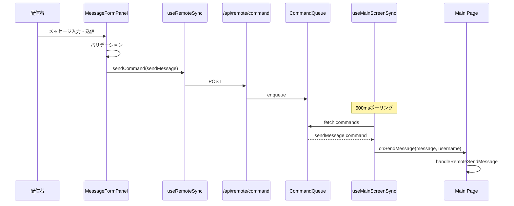

# Design Document: remote-message-form

## Overview

**Purpose**: /remote画面にメッセージ入力フォームを追加し、配信者がリモートからメイン画面へメッセージを送信できるようにする機能。

**Users**: 配信者がスマートフォンやタブレットから/remoteページを開き、メイン画面を操作せずにチャットを送信する。

**Impact**: 既存の`RemoteCommand`型と`useMainScreenSync`フックを拡張し、新しいコマンドタイプ`sendMessage`を追加する。

### Goals
- /remote画面からメッセージとユーザー名を指定して送信可能にする
- 台本パネル・自動送信パネル・メッセージフォームの表示切り替えを実装
- パネル表示状態をlocalStorageで永続化

### Non-Goals
- メッセージ履歴の表示（/remote画面での実装は対象外）
- リアルタイムのメッセージ配信確認UI
- 複数ユーザー名のプリセット管理

## Architecture

### Existing Architecture Analysis
- 既存の`RemoteCommand`型は判別共用体で定義（`lib/remoteState.ts`）
- `/api/remote/command`でコマンドをキューに追加
- メイン画面は`useMainScreenSync`で500msポーリングでコマンドを受信・実行
- `sendScript`コマンドが既に同様のパターンで実装済み

### Architecture Pattern & Boundary Map

```mermaid
graph TB
    subgraph Remote[Remote Control Page]
        MF[MessageFormPanel]
        SP[ScriptPanel]
        ASP[ScriptAutoSenderPanel]
        PT[PanelToggle]
    end

    subgraph Hooks
        URS[useRemoteSync]
    end

    subgraph API
        CMD[/api/remote/command]
        CMDS[/api/remote/commands]
    end

    subgraph Main[Main Page]
        UMSS[useMainScreenSync]
        HSM[handleSendMessage]
    end

    MF -->|sendCommand| URS
    URS -->|POST| CMD
    CMD -->|queue| CMDS
    CMDS -->|poll| UMSS
    UMSS -->|onSendMessage| HSM
    PT -->|toggle| MF
    PT -->|toggle| SP
    PT -->|toggle| ASP
```

**Architecture Integration**:
- Selected pattern: 既存コマンドパターンの拡張
- Domain/feature boundaries: UIコンポーネント（Remote）→ Hooks → API → Main Page
- Existing patterns preserved: RemoteCommand判別共用体、ポーリングベースの同期
- New components rationale: MessageFormPanelはメッセージ入力専用UI、PanelToggleは表示制御
- Steering compliance: Next.js App Router構成、TypeScript strict mode

### Technology Stack

| Layer | Choice / Version | Role in Feature | Notes |
|-------|------------------|-----------------|-------|
| Frontend | React 19, Next.js 16 | UIコンポーネント、状態管理 | 既存スタック |
| State | localStorage | パネル表示状態・ユーザー名永続化 | ブラウザAPI |
| API | Next.js API Routes | コマンド送信・受信 | 既存エンドポイント拡張 |

## System Flows

### メッセージ送信フロー



**Key Decisions**:
- 既存のポーリングベース同期を使用（WebSocket不要）
- バリデーションはクライアント側で実行（空メッセージ防止）

## Requirements Traceability

| Requirement | Summary | Components | Interfaces | Flows |
|-------------|---------|------------|------------|-------|
| 1.1, 1.2, 1.3, 1.4, 1.5 | メッセージ入力フォーム | MessageFormPanel | MessageFormPanelProps | メッセージ送信フロー |
| 2.1, 2.2, 2.3, 2.4 | ユーザー名指定 | MessageFormPanel | SendMessageCommand | メッセージ送信フロー |
| 3.1, 3.2, 3.3, 3.4 | パネル表示切り替え | RemoteControlPage, PanelToggle | PanelVisibility | - |
| 4.1, 4.2, 4.3 | メイン画面連携 | useMainScreenSync, Main Page | onSendMessage, SendMessageCommand | メッセージ送信フロー |

## Components and Interfaces

| Component | Domain/Layer | Intent | Req Coverage | Key Dependencies | Contracts |
|-----------|--------------|--------|--------------|------------------|-----------|
| MessageFormPanel | UI | メッセージ入力・送信UI | 1.1-1.5, 2.1-2.4 | useRemoteSync (P0) | Props, State |
| RemoteControlPage | UI | パネル表示管理 | 3.1-3.4 | MessageFormPanel (P0), ScriptPanel (P1) | State |
| SendMessageCommand | Data | コマンド型定義 | 4.2 | RemoteCommand (P0) | Type |
| useMainScreenSync | Hooks | コマンド受信・実行 | 4.1 | onSendMessage callback (P0) | Service |

### UI Layer

#### MessageFormPanel

| Field | Detail |
|-------|--------|
| Intent | メッセージとユーザー名を入力し、リモートからメイン画面へ送信するUIパネル |
| Requirements | 1.1, 1.2, 1.3, 1.4, 1.5, 2.1, 2.2, 2.3, 2.4 |

**Responsibilities & Constraints**
- メッセージ入力フィールドとユーザー名入力フィールドを提供
- 送信ボタンのクリックおよびEnterキーでフォーム送信
- 空メッセージ時は送信を無効化
- ユーザー名をlocalStorageに永続化

**Dependencies**
- Outbound: useRemoteSync — sendCommand呼び出し (P0)

**Contracts**: State [x]

##### Props Interface
```typescript
interface MessageFormPanelProps {
  /** メッセージ送信時のコールバック */
  onMessageSend: (message: string, username: string) => Promise<void>;
  /** 送信中かどうか（外部から制御） */
  isSending?: boolean;
}
```

##### State Management
```typescript
interface MessageFormPanelState {
  message: string;
  username: string;
  error: string | null;
}
```
- State model: message（送信後クリア）、username（永続化）、error（送信エラー時）
- Persistence: usernameはlocalStorage `remote-message-username`に保存
- Initialization: useEffectでlocalStorageから読み込み、デフォルト「配信者」

**Implementation Notes**
- Integration: 既存ScriptPanelと同様のスタイリング
- Validation: message.trim()が空の場合は送信無効
- Risks: 日本語入力中のEnter送信防止（`e.nativeEvent.isComposing`チェック）

#### RemoteControlPage（拡張）

| Field | Detail |
|-------|--------|
| Intent | パネル表示切り替え機能の追加 |
| Requirements | 3.1, 3.2, 3.3, 3.4 |

**Responsibilities & Constraints**
- 各パネル（台本、自動送信、メッセージフォーム）の表示/非表示トグル
- 表示状態をlocalStorageに永続化
- 最低1つのパネルを常に表示

**Contracts**: State [x]

##### State Management
```typescript
interface PanelVisibility {
  script: boolean;
  autoSender: boolean;
  messageForm: boolean;
}
```
- Persistence: localStorage `remote-panel-visibility`に保存
- Default: `{ script: true, autoSender: true, messageForm: true }`
- Constraint: 全てfalseになる操作は無視（最後の1つは非表示にできない）

### Data Layer

#### SendMessageCommand（型拡張）

| Field | Detail |
|-------|--------|
| Intent | リモートからメイン画面へメッセージを送信するコマンド型 |
| Requirements | 4.2 |

**Type Definition**
```typescript
// lib/remoteState.ts への追加
export type RemoteCommand =
  | { type: 'selectMode'; mode: 'standby' | 'room' }
  | { type: 'controlVideo'; action: 'start' | 'end' }
  | { type: 'sendScript'; script: Script }
  | { type: 'toggleOneComme'; enabled: boolean }
  | { type: 'setUIVisibility'; target: 'controls' | 'chatHistory' | 'chatInput'; visible: boolean }
  | { type: 'sendMessage'; message: string; username: string };  // 追加
```

### Hooks Layer

#### useMainScreenSync（拡張）

| Field | Detail |
|-------|--------|
| Intent | sendMessageコマンドの受信・実行 |
| Requirements | 4.1 |

**Interface Extension**
```typescript
export interface UseMainScreenSyncOptions {
  // 既存のプロパティ...
  onSendMessage?: (message: string, username: string) => void;  // 追加
}
```

**Implementation Notes**
- Integration: handleCommand内でcase 'sendMessage'を追加
- Validation: コマンドAPIレイヤーで型チェック済み

## Data Models

### Domain Model
- **Message**: ユーザーからの入力テキスト（送信後は状態からクリア）
- **Username**: 送信者名（デフォルト「配信者」、永続化対象）
- **PanelVisibility**: 3パネルの表示状態（永続化対象）

### Data Contracts & Integration

**API Data Transfer**
```typescript
// POST /api/remote/command
// Request body (sendMessage type)
{
  type: 'sendMessage',
  message: string,
  username: string
}

// Response: 200 OK (empty body)
```

## Error Handling

### Error Categories and Responses
**User Errors**:
- 空メッセージ送信 → ボタン無効化で防止
- ユーザー名未入力 → デフォルト値「配信者」を使用

**System Errors**:
- コマンド送信失敗 → エラーメッセージ表示、再送信可能

### Monitoring
- コンソールログでエラー出力（既存パターン踏襲）

## Testing Strategy

### Unit Tests
- MessageFormPanel: 空メッセージ時のボタン無効化
- MessageFormPanel: Enter送信（日本語入力確定中除外）
- MessageFormPanel: ユーザー名のlocalStorage永続化
- PanelVisibility: 最後の1パネルは非表示不可

### Integration Tests
- sendMessageコマンドの送信→受信フロー
- useMainScreenSyncでのonSendMessageコールバック呼び出し
