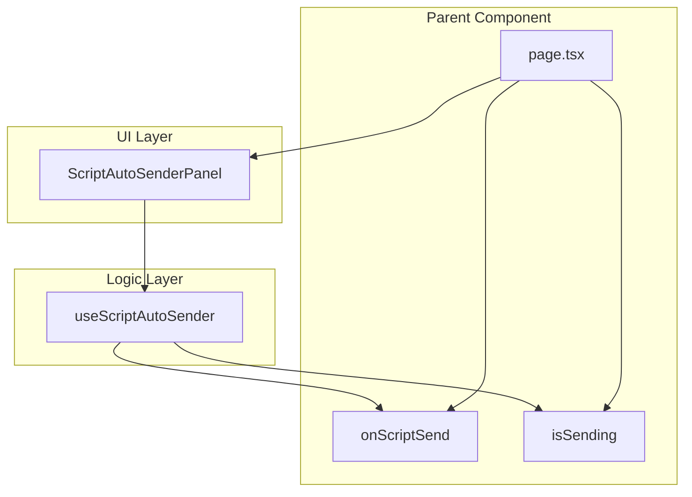
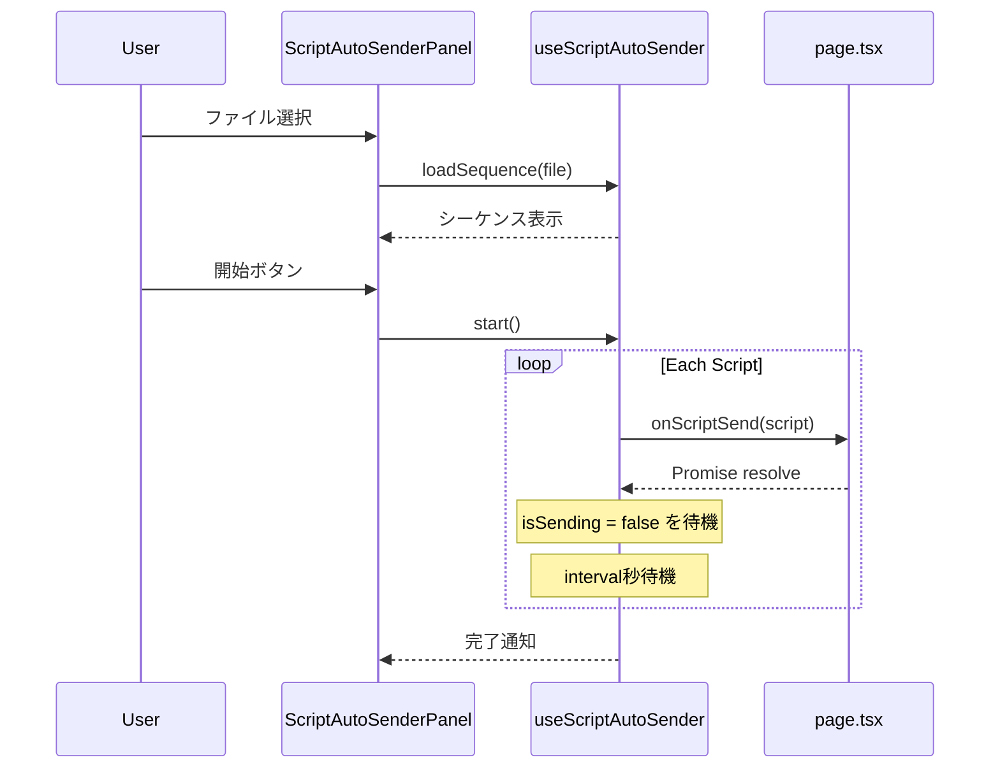
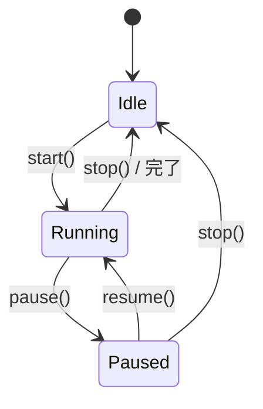
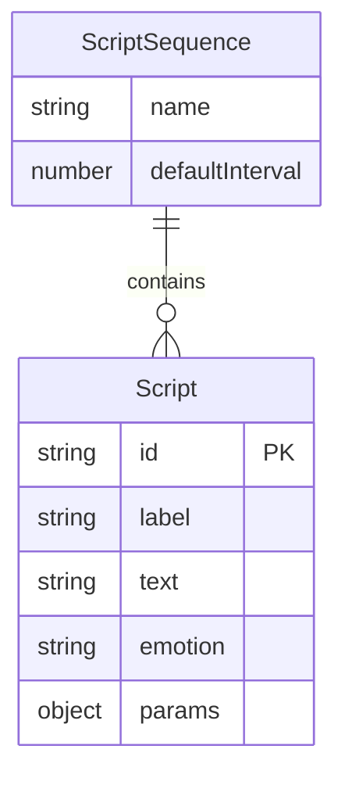

# Design Document

## Overview
**Purpose**: 本機能は、あらかじめ作成した台本シーケンスファイルを読み込み、ボタン一つで複数の台本を自動的に順次送信する機能を提供する。

**Users**: 配信者が配信中に定型的な台本を自動送信し、手動操作の手間を削減する。

**Impact**: 既存の `ScriptPanel` と並行して使用可能な新コンポーネントを追加。既存機能への変更は最小限。

### Goals
- 台本シーケンスファイル（JSON形式）の読み込みとバリデーション
- 開始/一時停止/再開/停止の制御付き自動順次送信
- 送信間隔の調整機能
- 既存 `onScriptSend` インターフェースとの統合

### Non-Goals
- サーバーサイドでのファイル管理機能
- 複数シーケンスの同時実行
- シーケンスの編集・保存機能

## Architecture

### Existing Architecture Analysis
- `ScriptPanel`: 単一台本の選択・送信UI、`onScriptSend`/`isSending` props
- `Script`型: `id`, `label`, `text`, `emotion?`, `params?` で構成
- 台本送信は親コンポーネント（`page.tsx`）が `handleScriptSend` を提供

### Architecture Pattern & Boundary Map



**Architecture Integration**:
- Selected pattern: Hook + Component分離（既存の `useOneComme` パターンに準拠）
- Domain boundaries: UIはPanelコンポーネント、ロジックはカスタムHook
- Existing patterns preserved: `onScriptSend`/`isSending` インターフェース
- New components rationale: 自動送信ロジックは既存ScriptPanelと独立して管理
- Steering compliance: Next.js App Router構成、TypeScript strict mode

### Technology Stack

| Layer | Choice / Version | Role in Feature | Notes |
|-------|------------------|-----------------|-------|
| Frontend | React 19 | UIコンポーネント、Hooks | 既存スタック |
| UI | Tailwind CSS 4 | スタイリング | 既存ScriptPanelと統一 |
| File API | Browser Native | シーケンスファイル読み込み | クライアントサイド処理 |

## System Flows

### 自動送信フロー



### 状態遷移



## Requirements Traceability

| Requirement | Summary | Components | Interfaces | Flows |
|-------------|---------|------------|------------|-------|
| 1.1 | ファイル選択・パース | ScriptAutoSenderPanel | loadSequence | ファイル読み込み |
| 1.2 | JSON形式サポート | useScriptAutoSender | parseSequenceFile | - |
| 1.3 | 形式不正エラー | useScriptAutoSender | SequenceError | - |
| 1.4 | 件数・プレビュー表示 | ScriptAutoSenderPanel | AutoSenderState | - |
| 2.1 | 開始ボタン | ScriptAutoSenderPanel, useScriptAutoSender | start() | 自動送信フロー |
| 2.2 | 間隔待機 | useScriptAutoSender | interval | 自動送信フロー |
| 2.3 | 進捗表示 | ScriptAutoSenderPanel | currentIndex, total | - |
| 2.4 | 完了通知 | ScriptAutoSenderPanel | status: completed | 自動送信フロー |
| 3.1 | 一時停止 | useScriptAutoSender | pause() | 状態遷移 |
| 3.2 | 再開 | useScriptAutoSender | resume() | 状態遷移 |
| 3.3 | 停止 | useScriptAutoSender | stop() | 状態遷移 |
| 3.4 | 開始ボタン無効化 | ScriptAutoSenderPanel | status: running | - |
| 4.1 | 間隔設定UI | ScriptAutoSenderPanel | setInterval | - |
| 4.2 | デフォルト間隔 | useScriptAutoSender | DEFAULT_INTERVAL | - |
| 4.3 | 最小値制約 | useScriptAutoSender | setInterval | - |
| 4.4 | 実行中の間隔変更 | useScriptAutoSender | setInterval | - |
| 5.1 | onScriptSend使用 | useScriptAutoSender | onScriptSend prop | - |
| 5.2 | isSending参照 | useScriptAutoSender | isSending prop | - |
| 5.3 | UIスタイル統一 | ScriptAutoSenderPanel | - | - |
| 5.4 | 手動送信との独立 | useScriptAutoSender | - | - |

## Components and Interfaces

| Component | Domain/Layer | Intent | Req Coverage | Key Dependencies | Contracts |
|-----------|--------------|--------|--------------|------------------|-----------|
| useScriptAutoSender | Logic | 自動送信状態管理 | 1.2-1.3, 2.1-2.4, 3.1-3.4, 4.2-4.4, 5.1-5.2, 5.4 | onScriptSend (P0), isSending (P0) | State |
| ScriptAutoSenderPanel | UI | 自動送信操作UI | 1.1, 1.4, 2.3, 3.4, 4.1, 5.3 | useScriptAutoSender (P0) | - |

### Logic Layer

#### useScriptAutoSender

| Field | Detail |
|-------|--------|
| Intent | 台本シーケンスの読み込み・自動送信・状態管理を行うカスタムHook |
| Requirements | 1.2, 1.3, 2.1, 2.2, 2.3, 2.4, 3.1, 3.2, 3.3, 3.4, 4.2, 4.3, 4.4, 5.1, 5.2, 5.4 |

**Responsibilities & Constraints**
- シーケンスファイルのパースとバリデーション
- 状態機械（idle/running/paused）の管理
- タイマー制御（送信間隔）
- 送信完了（`isSending` false遷移）の監視

**Dependencies**
- Inbound: onScriptSend — 台本送信関数 (P0)
- Inbound: isSending — 送信中状態 (P0)

**Contracts**: State [x]

##### State Management

```typescript
/** 自動送信の状態 */
type AutoSenderStatus = 'idle' | 'running' | 'paused' | 'completed';

/** シーケンスファイル形式 */
interface ScriptSequence {
  /** シーケンス名（任意） */
  name?: string;
  /** 台本配列 */
  scripts: Script[];
  /** デフォルト送信間隔（秒） */
  defaultInterval?: number;
}

/** Hook の返却状態 */
interface AutoSenderState {
  /** 現在のステータス */
  status: AutoSenderStatus;
  /** 読み込んだシーケンス */
  sequence: ScriptSequence | null;
  /** 現在の送信インデックス（0始まり） */
  currentIndex: number;
  /** 送信間隔（秒） */
  interval: number;
  /** エラーメッセージ */
  error: string | null;
}

/** Hook の返却アクション */
interface AutoSenderActions {
  /** シーケンスファイルを読み込む */
  loadSequence: (file: File) => Promise<void>;
  /** 自動送信を開始 */
  start: () => void;
  /** 一時停止 */
  pause: () => void;
  /** 再開 */
  resume: () => void;
  /** 停止（リセット） */
  stop: () => void;
  /** 送信間隔を設定（秒、最小0） */
  setInterval: (seconds: number) => void;
  /** シーケンスをクリア */
  clearSequence: () => void;
}

/** Hook のシグネチャ */
type UseScriptAutoSender = (
  onScriptSend: (script: Script) => Promise<void>,
  isSending: boolean
) => AutoSenderState & AutoSenderActions;
```

**Implementation Notes**
- Integration: `useEffect` で `isSending` の変化を監視し、false遷移で次の送信をトリガー
- Validation: `parseScriptsConfig` を再利用してシーケンス内の台本をバリデーション
- Risks: `isSending` が長時間trueの場合のタイムアウト処理を実装推奨

### UI Layer

#### ScriptAutoSenderPanel

| Field | Detail |
|-------|--------|
| Intent | 台本シーケンスの読み込み・自動送信操作のUIを提供 |
| Requirements | 1.1, 1.4, 2.3, 3.4, 4.1, 5.3 |

**Responsibilities & Constraints**
- ファイル選択UIの提供
- 進捗表示（現在位置/総数）
- 制御ボタン（開始/一時停止/再開/停止）
- 送信間隔設定UI
- 既存ScriptPanelと同じUIスタイル

**Dependencies**
- Inbound: onScriptSend — 親から渡される送信関数 (P0)
- Inbound: isSending — 親から渡される送信状態 (P0)
- Internal: useScriptAutoSender — 状態管理Hook (P0)

**Contracts**: なし（UIコンポーネント）

```typescript
interface ScriptAutoSenderPanelProps {
  /** 台本送信時のコールバック */
  onScriptSend: (script: Script) => Promise<void>;
  /** 送信中かどうか（外部から制御） */
  isSending?: boolean;
}
```

**Implementation Notes**
- Integration: `<input type="file" accept=".json">` でファイル選択
- Validation: ファイル選択時に即座にパースしてエラー表示
- Risks: 大量の台本表示時のスクロールUX

## Data Models

### Domain Model



**Aggregates**: `ScriptSequence` がルート、`Script` は値オブジェクト
**Invariants**:
- `scripts` 配列は1件以上必須
- 各 `Script` は既存の `validateScript` でバリデーション

### Data Contracts & Integration

**シーケンスファイル形式（JSON）**:
```json
{
  "name": "配信オープニング",
  "defaultInterval": 5,
  "scripts": [
    {
      "id": "open-1",
      "label": "挨拶",
      "text": "こんにちは！今日も配信に来てくれてありがとう！",
      "emotion": "happy"
    },
    {
      "id": "open-2",
      "label": "告知",
      "text": "今日は新機能を紹介していきます！"
    }
  ]
}
```

**バリデーションルール**:
- `scripts`: 必須、1件以上の配列
- 各 `Script`: 既存 `validateScript` と同一（`id`, `label`, `text` 必須）
- `name`: 任意、文字列
- `defaultInterval`: 任意、数値（省略時はシステムデフォルト）

## Error Handling

### Error Categories and Responses

**User Errors (ファイル関連)**:
- ファイル形式不正 → 「JSONファイルを選択してください」
- JSON構文エラー → 「ファイルの形式が不正です: {詳細}」
- scripts配列なし → 「scriptsプロパティが見つかりません」
- scripts空配列 → 「台本が1件以上必要です」
- 個別台本エラー → 「{index}番目の台本: {エラー内容}」

**System Errors (送信関連)**:
- 送信タイムアウト → 警告表示、手動停止を促す
- 送信失敗 → エラー表示、一時停止状態に遷移

### Monitoring
- エラー発生時は `console.error` でログ出力
- 状態遷移は `console.log` でデバッグ情報出力（開発時）

## Testing Strategy

### Unit Tests
- `parseScriptSequence`: 正常系・異常系のパース処理
- 状態遷移: idle→running→paused→running→idle の各パターン
- 間隔設定: 負の値、0、正の値の境界値テスト
- バリデーション: 不正な形式のファイル検出

### Integration Tests
- `useScriptAutoSender` + モック `onScriptSend`: 全台本が順次送信されることを確認
- 一時停止・再開のタイミングで正しいインデックスから再開
- `isSending` 状態変化への正しい応答

### E2E/UI Tests
- ファイル選択→プレビュー表示→開始→進捗表示→完了の一連フロー
- 一時停止/再開/停止ボタンの動作確認
- エラー表示とリトライ動作
