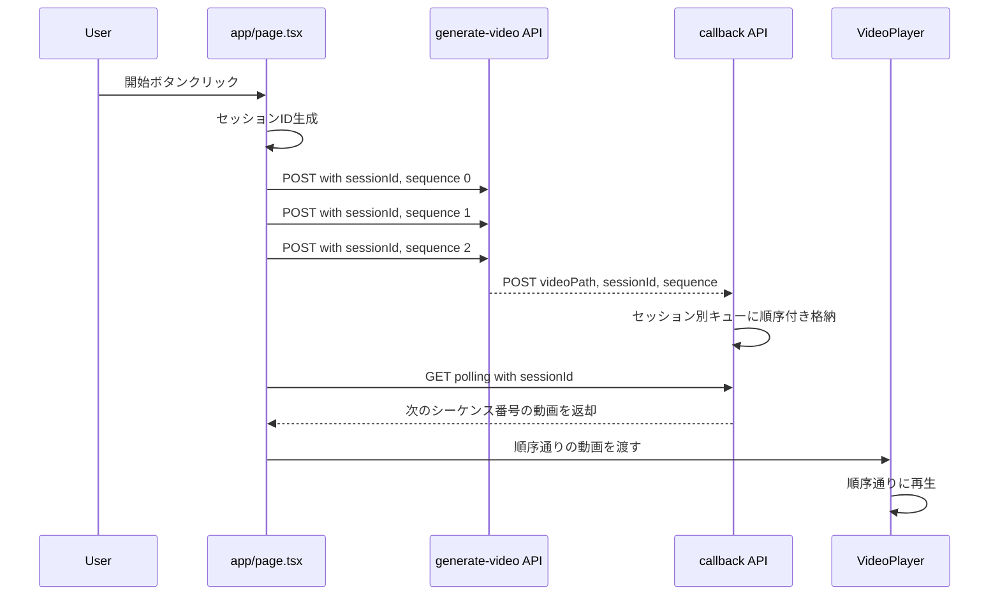
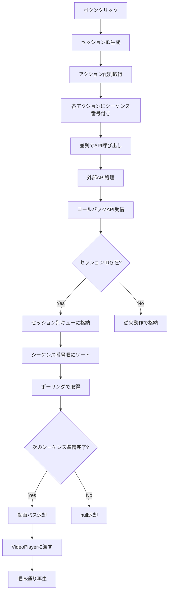
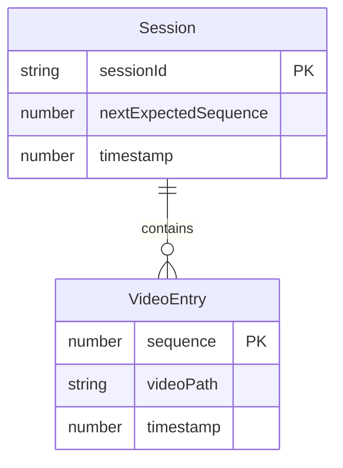

# Design Document: video-order-fix

## Overview

**Purpose**: コントロールボタン（「開始」「終了」）で取得する動画の再生順序を、設定ファイルで定義した順序通りに保証する。

**Users**: 配信者がコントロールボタンを使用して、意図した順序で演出動画を再生できるようになる。

**Impact**: 既存の動画生成・コールバック・ポーリング機構にシーケンス番号とセッション管理を追加し、順序保証を実現する。

### Goals
- 設定ファイルの`actions`配列順序通りに動画を再生
- 並列処理のパフォーマンスを維持
- 既存機能との後方互換性を確保

### Non-Goals
- WebSocketへの移行
- 動画生成APIの変更
- チャット応答動画の順序管理（本修正はコントロールボタンのみ対象）

## Architecture

### Existing Architecture Analysis

現在の問題点:
- `Promise.all`による並列リクエストで動画生成完了順序が不定
- `generate-video-callback`のMapは到着順で格納
- ポーリングは順序を考慮せず最古エントリを返却
- VideoPlayerは受け取り順序をそのまま使用

既存パターン:
- ポーリング方式（1秒間隔）
- API Routes経由のバックエンド処理
- React Hooksによる状態管理

### Architecture Pattern & Boundary Map



**Architecture Integration**:
- Selected pattern: シーケンス番号によるセッションベース順序管理
- Domain boundaries: フロントエンド（リクエスト送信・状態管理）、API（キュー管理）
- Existing patterns preserved: ポーリング方式、React Hooks状態管理
- New components rationale: セッション管理とシーケンス番号付与のみ追加
- Steering compliance: TypeScript strict mode、Next.js App Router準拠

### Technology Stack

| Layer | Choice / Version | Role in Feature | Notes |
|-------|------------------|-----------------|-------|
| Frontend | React 19 | 状態管理、セッションID生成 | 既存利用 |
| Backend | Next.js API Routes | コールバックキュー管理 | 既存拡張 |
| Data | In-memory Map | セッション別動画キュー | 既存構造を拡張 |

## System Flows

### コントロールボタン押下時のフロー



## Requirements Traceability

| Requirement | Summary | Components | Interfaces | Flows |
|-------------|---------|------------|------------|-------|
| 1.1 | 開始ボタンで順序通り再生 | fetchControlVideo, VideoPlayer | - | コントロールボタンフロー |
| 1.2 | 終了ボタンで順序通り再生 | fetchControlVideo, VideoPlayer | - | コントロールボタンフロー |
| 1.3 | シーケンス番号付与 | fetchControlVideo | GenerateVideoRequest | コントロールボタンフロー |
| 1.4 | afterActionsは後に再生 | fetchControlVideo | - | コントロールボタンフロー |
| 2.1 | シーケンス番号で順序付け格納 | CallbackAPI | VideoCallbackRequest | コールバック受信フロー |
| 2.2 | シーケンス番号昇順で取り出し | CallbackAPI | VideoCallbackResponse | ポーリングフロー |
| 2.3 | 先行シーケンス待機 | CallbackAPI | VideoCallbackResponse | ポーリングフロー |
| 2.4 | セッションID管理 | fetchControlVideo, CallbackAPI | SessionVideoQueue | 全フロー |
| 3.1 | 次のシーケンスのみ返却 | CallbackAPI | VideoCallbackResponse | ポーリングフロー |
| 3.2 | 未到着時はnull返却 | CallbackAPI | VideoCallbackResponse | ポーリングフロー |
| 3.3 | セッションクリーンアップ | CallbackAPI | - | クリーンアップフロー |
| 4.1 | 配列先頭から順番に再生 | VideoPlayer | VideoPlayerProps | 再生フロー |
| 4.2 | 自動連続再生 | VideoPlayer | - | 再生フロー |
| 4.3 | 受け取り順序維持 | VideoPlayer | - | 再生フロー |

## Components and Interfaces

| Component | Domain/Layer | Intent | Req Coverage | Key Dependencies | Contracts |
|-----------|--------------|--------|--------------|------------------|-----------|
| fetchControlVideo | Frontend | コントロール動画の取得とセッション管理 | 1.1-1.4, 2.4 | appConfig (P0) | State |
| CallbackAPI | Backend | 動画コールバックの順序付き格納・取得 | 2.1-2.4, 3.1-3.3 | - | API |
| VideoPlayer | Frontend | 動画の順序通り再生 | 4.1-4.3 | pendingGeneratedVideos (P0) | State |

### Frontend Layer

#### fetchControlVideo（app/page.tsx内）

| Field | Detail |
|-------|--------|
| Intent | コントロールボタン押下時の動画取得とセッション管理 |
| Requirements | 1.1, 1.2, 1.3, 1.4, 2.4 |

**Responsibilities & Constraints**
- セッションIDの生成と管理
- アクション配列へのシーケンス番号付与
- 並列リクエスト送信（パフォーマンス維持）

**Dependencies**
- Inbound: handleStartButton, handleEndButton — ボタンハンドラ (P0)
- Outbound: generate-video API — 動画生成リクエスト (P0)
- External: appConfig — ボタン設定 (P0)

**Contracts**: State [x]

##### State Management
- State model:
  - `controlVideoSessionId: string | null` — 現在のセッションID
  - `expectedSequenceCount: number` — 期待するシーケンス数
- Persistence: React useState
- Concurrency: シングルスレッド（React）

**Implementation Notes**
- Integration: `crypto.randomUUID()`でセッションID生成
- Validation: ボタン連打防止は既存の`isLoadingControlVideo`で対応
- Risks: セッションIDの重複（UUIDで実質無視可能）

#### VideoPlayer

| Field | Detail |
|-------|--------|
| Intent | 動画の順序通り再生 |
| Requirements | 4.1, 4.2, 4.3 |

**Responsibilities & Constraints**
- initialQueueの順序維持
- pendingGeneratedVideosの順序通り処理
- ダブルバッファリングによるシームレス切り替え

**Dependencies**
- Inbound: page.tsx — 動画パス配列 (P0)
- Outbound: video要素 — 再生制御 (P0)

**Contracts**: State [x]

##### State Management
- State model: 既存の`pendingGeneratedVideos`配列を順序維持で使用
- Persistence: React useState
- Concurrency: シングルスレッド（React）

**Implementation Notes**
- Integration: 既存のuseEffectフローを維持
- Validation: processedVideoPathsRefで重複再生防止
- Risks: 特になし（既存ロジックで順序維持済み）

### Backend Layer

#### CallbackAPI（app/api/generate-video-callback/route.ts）

| Field | Detail |
|-------|--------|
| Intent | 動画コールバックの順序付き格納・取得 |
| Requirements | 2.1, 2.2, 2.3, 2.4, 3.1, 3.2, 3.3 |

**Responsibilities & Constraints**
- セッション別の動画キュー管理
- シーケンス番号による順序保証
- 古いセッションの自動クリーンアップ

**Dependencies**
- Inbound: 外部動画生成API — コールバック (P0)
- Inbound: page.tsx — ポーリング (P0)

**Contracts**: API [x]

##### API Contract

| Method | Endpoint | Request | Response | Errors |
|--------|----------|---------|----------|--------|
| POST | /api/generate-video-callback | VideoCallbackRequest | `{ success: true, id: string }` | 400, 500 |
| GET | /api/generate-video-callback | `?sessionId=xxx` | VideoCallbackResponse | 500 |

**Implementation Notes**
- Integration: 既存のMapベースキューをセッション対応に拡張
- Validation: sessionIdとsequenceの存在チェック
- Risks: メモリリーク対策として1時間経過セッションを削除

## Data Models

### Domain Model



**Aggregates**: Session（セッションIDでグループ化された動画エントリの集合）
**Invariants**: 同一セッション内のシーケンス番号は一意

### Logical Data Model

**SessionVideoQueue**:
```typescript
interface SessionVideoQueue {
  sessionId: string;
  videos: Map<number, VideoEntry>; // sequence -> VideoEntry
  nextExpectedSequence: number;
  totalExpectedCount: number;
  createdAt: number;
}

interface VideoEntry {
  path: string;
  sequence: number;
  timestamp: number;
}
```

**Storage**: In-memory Map（既存パターン維持）
**Index**: sessionId（プライマリ）、sequence（セッション内）

### Data Contracts & Integration

**VideoCallbackRequest**（POST）:
```typescript
interface VideoCallbackRequest {
  videoPath: string;
  sessionId?: string;      // オプション（後方互換性）
  sequence?: number;       // オプション（後方互換性）
  totalCount?: number;     // セッション内の総動画数
}
```

**VideoCallbackResponse**（GET）:
```typescript
interface VideoCallbackResponse {
  videoPath: string | null;
  sessionId?: string;
  sequence?: number;
  isComplete?: boolean;    // セッション内全動画取得完了
}
```

**GenerateVideoRequest**（fetchControlVideo用）:
```typescript
interface GenerateVideoRequest {
  requests: Array<{
    action: string;
    params: Record<string, unknown>;
  }>;
  sessionId?: string;
  sequence?: number;
  totalCount?: number;
}
```

## Error Handling

### Error Strategy
- 後方互換性: sessionIdなしのリクエストは従来動作
- タイムアウト: 先行シーケンス未到着時はnullを返却し、フロントエンドでリトライ
- クリーンアップ: 1時間経過セッションを自動削除

### Error Categories and Responses
- **User Errors (4xx)**: videoPath未指定 → 400エラー
- **System Errors (5xx)**: 内部エラー → 500エラー、ログ出力

## Testing Strategy

### Unit Tests
- シーケンス番号の付与ロジック（fetchControlVideo）
- セッション別キューへの格納ロジック（CallbackAPI POST）
- シーケンス順取得ロジック（CallbackAPI GET）
- 古いセッションのクリーンアップ

### Integration Tests
- 開始ボタン→動画生成→コールバック→ポーリング→VideoPlayerの一連フロー
- 複数動画の順序保証確認
- 後方互換性（sessionIdなしの従来動作）

### E2E Tests
- 開始ボタン押下で設定順序通りに動画再生
- 終了ボタン押下で設定順序通りに動画再生
- afterActionsがactionsの後に再生される
